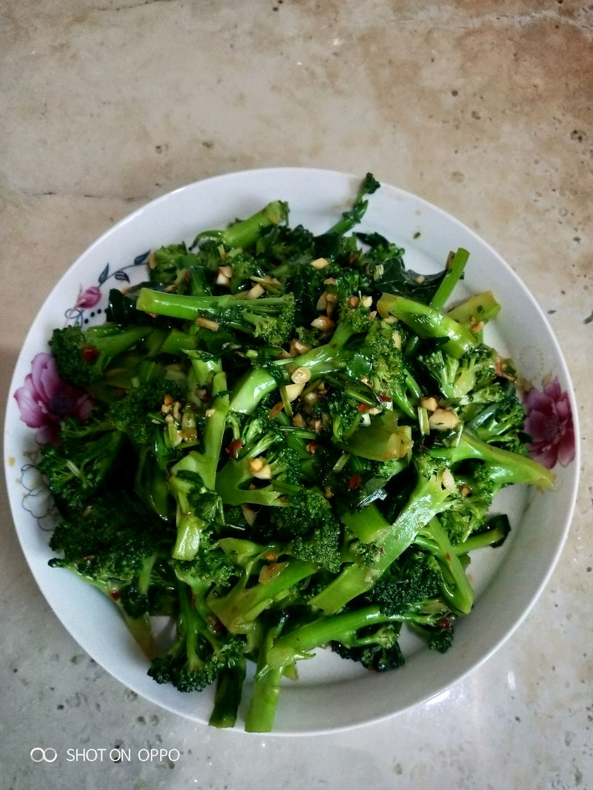

# 凉拌西兰花

## 📋 基本資訊 / Recipe Overview
- **料理名稱**：凉拌西兰花
- **原始標題**：凉拌西兰花
- **素食流派 / Diet**：全素 Vegan
- **料理分類 / Category**：涼拌前菜 / 輕食
- **來源平台 / Source**：[豆果美食 · 素食專區](https://www.douguo.com/cookbook/2419276.html)

## 🌿 食材及佐料清單 / Ingredients
- 西兰花:1个
- 配料:香菜、香葱、大蒜头、干辣椒、自制辣椒酱、生抽酱油、橄榄油、食盐。

## 🍳 烹飪步驟 / Step-by-Step Cooking Steps
1. 把西兰花切好
2. 把配料切好
3. 待水烧开倒入西兰花（转中小火）煮3分钟捞起沥水
4. 把香菜、大蒜、干辣椒、辣椒酱、食盐装入碗里浇热油，再放香葱、生抽酱油拌匀
滴几滴橄榄油或者香油，味更佳。
5. 将调好的酱料倒入西兰花中拌匀即可开食
6. 最后就是这个样子啦！

## 💡 大廚美味秘訣 / Chef's Tips
- 简单易操作，晚餐就行动吧！

---
*食譜歸檔時間：2026-08-21 · 來源：豆果美食 (www.douguo.com)*