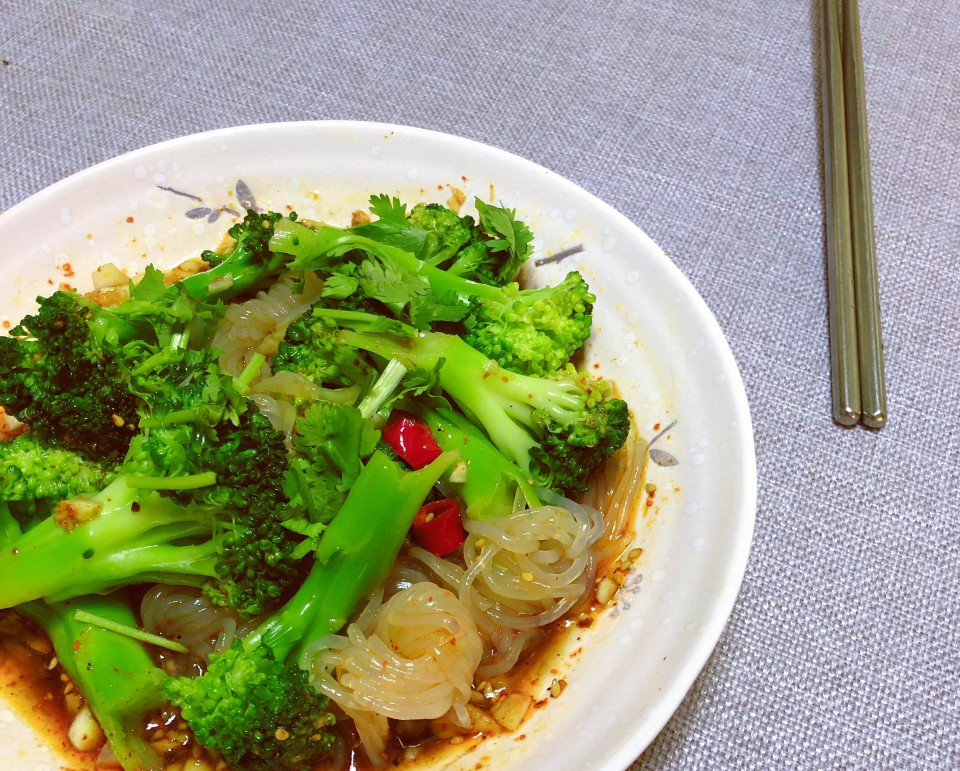

# 凉拌西兰花魔芋丝

## 📋 基本資訊 / Recipe Overview
- **料理名稱**：凉拌西兰花魔芋丝
- **原始標題**：凉拌西兰花魔芋丝
- **素食流派 / Diet**：全素 Vegan
- **料理分類 / Category**：涼拌前菜 / 輕食
- **來源平台 / Source**：[豆果美食 · 素食專區](https://www.douguo.com/cookbook/3109296.html)

## 🌿 食材及佐料清單 / Ingredients
- 魔芋丝 100g
- 西兰花 1颗
- 小米椒 1个
- 大蒜 3瓣
- 辣椒粉 1勺
- 香菜 2根
- 盐 半茶匙克
- 生抽 1勺
- 蚝油 1勺
- 白糖 1勺
- 陈醋 1勺半
- 花椒油 1茶匙

## 🍳 烹飪步驟 / Step-by-Step Cooking Steps
1. 西兰花切成小朵清水洗一遍，再放进盆中，加水和1勺淀粉，泡5分钟左右，这里加淀粉是为了吸附西兰花上清水冲洗不掉的脏东西
2. 然后倒掉盆里的水，把西兰花在洗两遍；魔芋丝用清水冲洗几遍；锅中烧水，水开放入西兰花和魔芋丝，再放1茶匙盐、一点点油，为了西兰花颜色更好看。
3. 焯水1分钟捞出西兰花、2分钟后捞出魔芋丝过冷水（西兰花不喜欢脆口的话就焯水2分钟）
4. 准备一个碗，蒜切末，小米辣切段，再加入辣椒粉和白芝麻，一起放进碗中
5. 过着热3勺油，油热泼在蒜末和辣椒粉上，用筷子搅拌均匀，再加入生抽、蚝油、陈醋、白糖麻椒油，搅拌均匀
6. 西兰花和魔芋丝挤干水分，把酱汁倒进来
7. 搅拌均匀即可

---
*食譜歸檔時間：2026-08-21 · 來源：豆果美食 (www.douguo.com)*