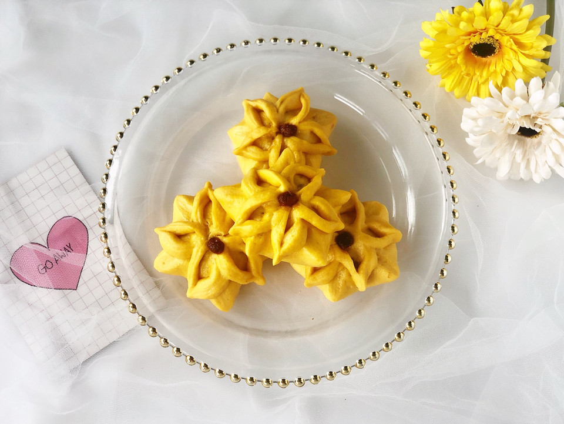

# 剪一剪，捏一捏，让南瓜豆沙包上开出一朵五瓣花

## 📋 基本資訊 / Recipe Overview
- **料理名稱**：剪一剪，捏一捏，让南瓜豆沙包上开出一朵五瓣花
- **原始標題**：剪一剪，捏一捏，让南瓜豆沙包上开出一朵五瓣花
- **素食流派 / Diet**：全素 Vegan
- **料理分類 / Category**：烘焙麵點 / 點心
- **來源平台 / Source**：[豆果美食 · 素食專區](https://www.douguo.com/cookbook/2337553.html)

## 🌿 食材及佐料清單 / Ingredients
- 面粉 400克
- 南瓜泥 240克
- 酵母 5克
- 细砂糖 60克
- 红豆沙 适量
- 枸杞 若干

## 🍳 烹飪步驟 / Step-by-Step Cooking Steps
1. 南瓜去皮切块蒸熟，然后捣成泥，放凉（和手温差不多即可，千万不要在南瓜泥还很烫的时候操作，这样会把酵母烫死，面团就发不起来了），然后把南瓜泥与面粉、酵母、细砂糖一起揉成光滑不粘手的面团，因为南瓜蒸的时候会有很多水分，面粉可以不加水，如果觉得面团太干，可以加适量水，根据实际情况调整。
2. 把面团放入不锈钢盆中，盆上盖一层保鲜膜，然后放在温暖处发酵至两倍大。如何判断面团是否发酵好了呢？首先是观察面团的大小，明显比发酵前大了；可以用手指沾面粉在面团中间戳一个洞，指洞不回缩不塌陷就发酵好了；扒开面团的内部，有蜂窝状组织，很蓬松。
3. 把面团放在案板上排气，然后揉成一个长条。排气就是不断的折叠、按压、揉搓，把面团发酵时内部产生的气体排出来，排气到什么程度呢？切开面团内部没有气孔，排气就比较彻底了，这样蒸出来的馒头成品就会很光滑。
4. 用刮面板把面条切成若干个剂子，每一段的长度尽量切的相同，这样每个剂子的大小也基本相同。
5. 把其中一个面剂子放在案板上或手中揉圆。
6. 把圆面团光滑的一面朝下，按扁，然后用擀面杖擀成中间厚四周薄的圆片，左手转动面片，右手来回推动擀面杖，和擀饺子皮一样。
7. 在面皮中间放入适量的豆沙馅，我用的豆沙馅是自制的，也可以用市售的，或者用别的自己喜欢的馅料都可以。
8. 然后把面皮包起，如图捏出五个边，捏紧，类似五角星的样子。
9. 用剪刀在每个边的顶部剪两刀，宽度约0.5cm，注意不要剪断哦。
10. 把一角的上一条边，对应相邻一角的下一条边，顶端捏紧，成一片花瓣，五个花瓣依次捏好。
11. 整理一下花瓣，在五瓣花的中间按上一个枸杞做花芯，一个美美的五瓣花豆沙包就做好啦！
12. 全部包好之后，进行二次发酵，发酵完成的判断方法：首先还是观察大小，馒头是发之前的1.5倍大，用手指轻轻在馒头表面上按一下，按出一个浅浅的指坑，如果指坑缓慢回弹，即发酵好了，如果不回弹，就是发过头了。
13. 二发好之后，上蒸锅水开后蒸15分钟，关火后焖3分钟后揭盖，成品美美哒！注意不要关火后立刻揭盖哦，这样有可能让馒头或包子回缩塌陷。
14. 有颜值又好吃的五瓣花南瓜豆沙包，不难做吧！

## 💡 大廚美味秘訣 / Chef's Tips
- 1、揉面可以借助面包机或厨师机，南瓜泥可以用料理机来打，这样比较细腻更容易揉匀。
2、因为南瓜泥的含水量和含固体量不同，每个品牌不同批次的面粉吸水性也不同，所以方子里南瓜泥的量仅供参考，并不是固定的，在和面的时候要根据具体情况调整。
3、我这次揉的面团水分有点多，面团偏软，所以成品的花瓣有点塌，亲们在做的时候可以把面揉的稍微硬一些，这样不仅方便造型，成品的花瓣也会更立体哦！

---
*食譜歸檔時間：2026-08-21 · 來源：豆果美食 (www.douguo.com)*