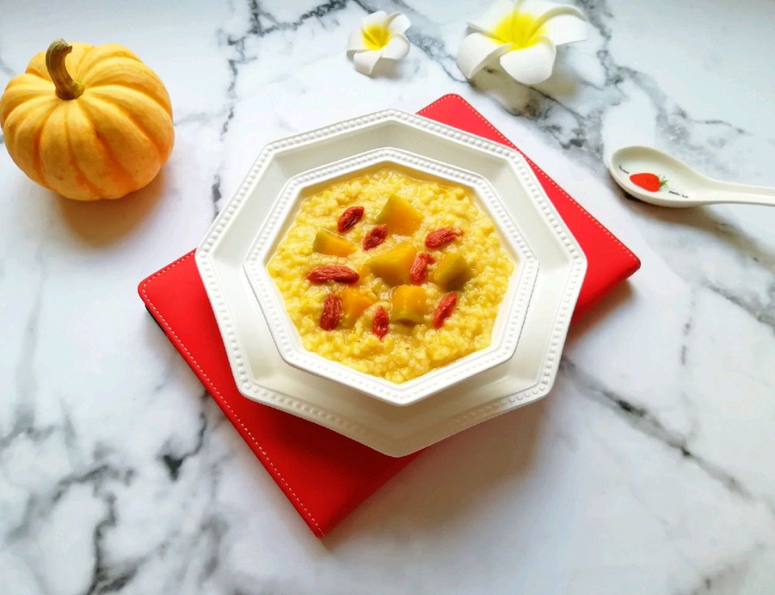

# 南瓜小米粥 (2)

## 📋 基本資訊 / Recipe Overview
- **料理名稱**：南瓜小米粥 (2)
- **原始標題**：南瓜小米粥
- **素食流派 / Diet**：全素 Vegan
- **料理分類 / Category**：米食料理
- **難易度 / Difficulty**：切墩(初级)
- **烹飪時間 / Cooking Time**：30~60分钟
- **來源平台 / Source**：[豆果美食 · 素食專區](https://www.douguo.com/cookbook/2360807.html)

## 📝 料理故事與簡介 / Story & Introduction
> 妈妈自己种的板栗南瓜，熬粥特别好吃。

## 🌿 食材及佐料清單 / Ingredients
- 板栗南瓜：245g
- 小米：80g
- 水：1000ml
- 枸杞：20粒

## 🍳 烹飪步驟 / Step-by-Step Cooking Steps
1. 南瓜去皮去瓤洗干净切成块。
2. 准备好小米淘洗干净。
3. 将南瓜和小米一起放进砂锅里。
4. 加入水大火烧开，转小火熬25分钟。
5. 下入洗干净的枸杞继续熬5分钟关火。
6. 在砂锅里焖一会儿再盛出。
7. 闻起来特别香。
8. 尝一下，口感太好了。
9. 近图看看。
10. 搭配南瓜小馒头和几颗红枣，早餐妥妥的。

## 💡 大廚美味秘訣 / Chef's Tips
- 喜欢吃甜粥也可以加一些糖进去。

---
*食譜歸檔時間：2026-08-20 · 來源：豆果美食 (www.douguo.com)*