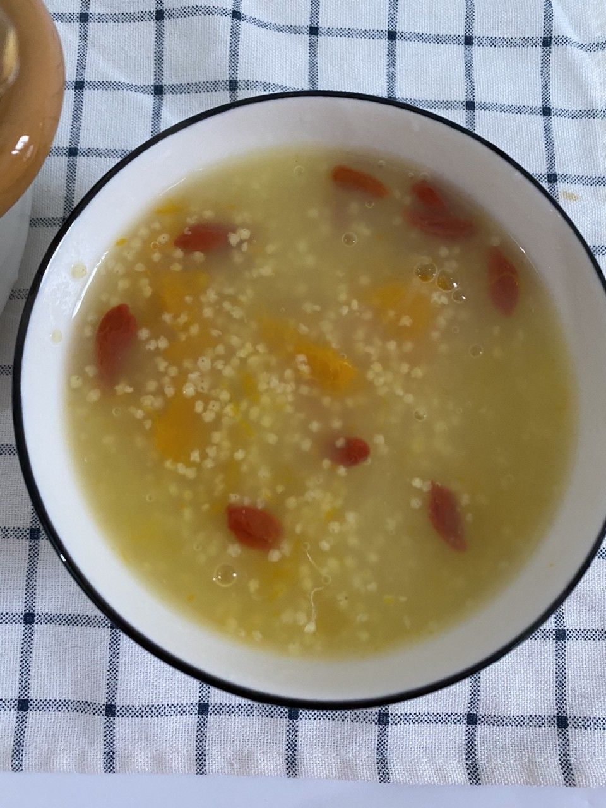

# 南瓜小米粥

## 📋 基本資訊 / Recipe Overview
- **料理名稱**：南瓜小米粥
- **原始標題**：南瓜小米粥
- **素食流派 / Diet**：全素 Vegan
- **料理分類 / Category**：米食料理
- **來源平台 / Source**：[豆果美食 · 素食專區](https://www.douguo.com/cookbook/3021033.html)

## 🌿 食材及佐料清單 / Ingredients
- 小米 66克
- 南瓜 1块
- 枸杞 5克
- 清水 适量
- 冰糖 1小块

## 🍳 烹飪步驟 / Step-by-Step Cooking Steps
1. 准备食材，小米最好用清水提前泡1到2个小时，煮出来的粥更加粘稠好吃，南瓜去皮切块
2. 小米洗干净沥水
3. 把南瓜小米冰糖一起放高压锅中
4. 加适量开水，水量根据自己喜爱来添加
5. 高压锅上汽后转中小火压10分钟就可以了
6. 枸杞提前浸泡一会儿，洗干净放入锅中焖一会再盛出
7. 搅拌均匀
8. 成品
9. 成品
10. 来喝吧，美好的一天从早餐开始哦

## 💡 大廚美味秘訣 / Chef's Tips
- 均衡的膳食对宝宝健康成长很关键哦，但要提醒饮食均衡还远远不够，日常饮食也有营养“缺口”，如维生素AD就不易从食物中获取充足。维生素AD能提高宝宝免疫力，促进骨骼发育、身高增长，预防近视和贫血。功夫在日常，每天还要记得补充一粒伊可新维生素AD滴剂哦~

---
*食譜歸檔時間：2026-08-21 · 來源：豆果美食 (www.douguo.com)*