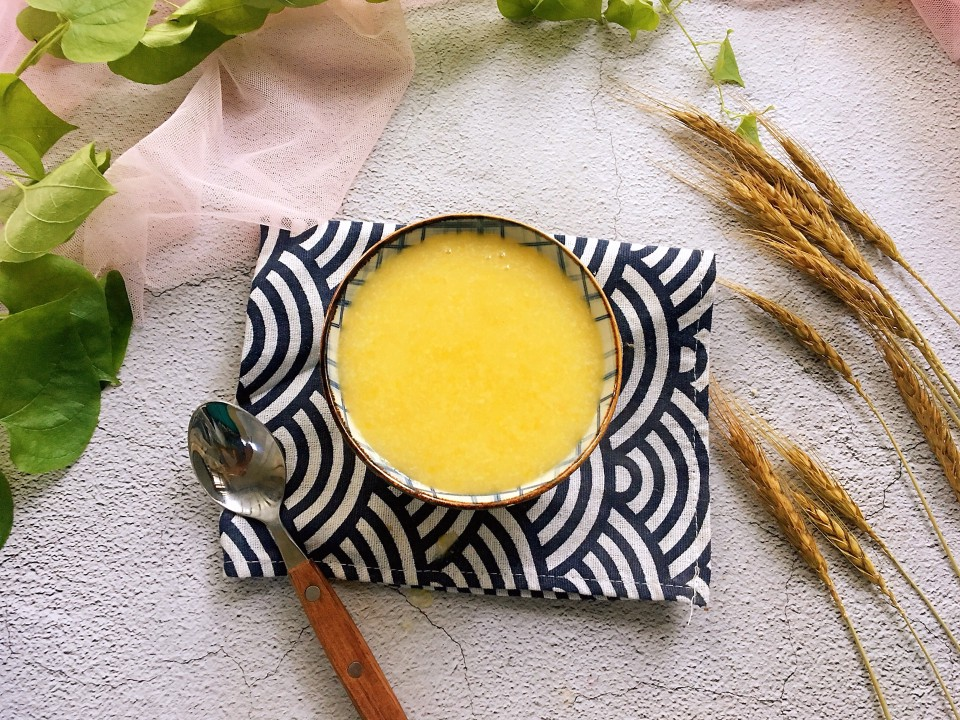

# 南瓜小米粥

## 📋 基本資訊 / Recipe Overview
- **料理名稱**：南瓜小米粥
- **原始標題**：南瓜小米粥
- **素食流派 / Diet**：全素 Vegan
- **料理分類 / Category**：米食料理
- **來源平台 / Source**：[豆果美食 · 素食專區](https://www.douguo.com/cookbook/2314413.html)

## 🌿 食材及佐料清單 / Ingredients
- 大米 100g
- 小米 30g
- 南瓜 50g
- 清水 800毫升

## 🍳 烹飪步驟 / Step-by-Step Cooking Steps
1. 南瓜洗净去皮切小块。
2. 大米淘洗干净。
3. 小米用清水冲洗干净。
4. 全部材料投入破壁机搅拌杯内。
5. 加入800毫升清水。
6. 盖上盖子，把搅拌杯放在主机上，选择熬粥功能，按下启动按钮静心等待就行了。
7. 浓稠绵软的粥。小宝宝也能喝。
8. 色泽金黄诱人。你也赶紧做起来吧！记得晒图哦。

## 💡 大廚美味秘訣 / Chef's Tips
- 南瓜和小米的功效都很强大，熬制成粥品既能保证食材原汁原味，又能使其中的营养成分得以很好地保留。胃口不好，体内有热毒也可以多喝南瓜小米粥。

---
*食譜歸檔時間：2026-08-21 · 來源：豆果美食 (www.douguo.com)*