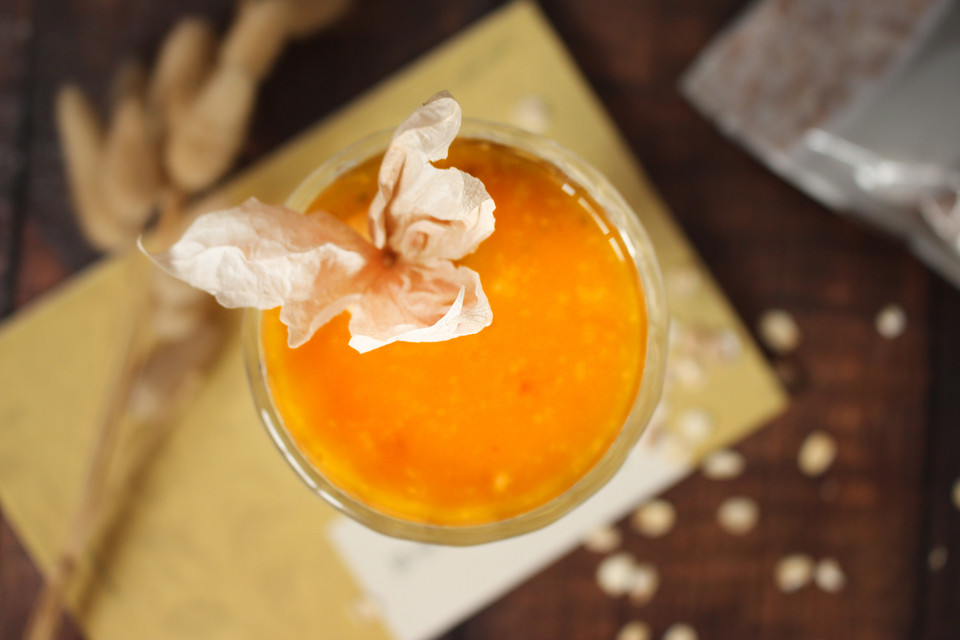

# 南瓜燕麦粥 秋意正浓

## 📋 基本資訊 / Recipe Overview
- **料理名稱**：南瓜燕麦粥 秋意正浓
- **原始標題**：【南瓜燕麦粥】秋意正浓
- **素食流派 / Diet**：奶素 Lacto-Vegetarian
- **料理分類 / Category**：米食料理
- **難易度 / Difficulty**：切墩(初级)
- **烹飪時間 / Cooking Time**：10分钟左右
- **來源平台 / Source**：[豆果美食 · 素食專區](https://www.douguo.com/cookbook/2345380.html)

## 📝 料理故事與簡介 / Story & Introduction
> 南瓜中丰富的类胡萝卜素在机体内可转化成具有重要生理功能的维生素A，南瓜还富含矿质元素、氨基酸和果胶，果胶能调节胃内食物的吸收速率，使糖类吸收减慢，可溶性纤维素能推迟胃内食物的排空，控制饭后血糖上升。燕麦片是全谷物的良好来源，能够完整保留谷粒所具有的胚乳、胚芽、麦麸和营养成分， 口感很香醇，只需要在麦片中加入适量的温水或温牛奶搅拌3分钟后即可食用。

## 🌿 食材及佐料清單 / Ingredients
- 即时燕麦片：35g
- 热牛奶：1杯
- 南瓜：100g
- 蜂蜜（可选）：适量

## 🍳 烹飪步驟 / Step-by-Step Cooking Steps
1. 将南瓜切小块放入锅中蒸熟
2. 将蒸熟的南瓜去皮放入料理机中，加少许牛奶打成南瓜泥（一碗燕麦粥用了图1中的三块南瓜）
3. 取35g即食燕麦片，倒入热牛奶泡3～5分钟（根据个人对稀稠度的喜好调节热牛奶分量）
4. 最后将南瓜泥放入奇亚籽燕麦粥中拌匀，因为南瓜本身是甜的，所以没有额外加蜂蜜，喜甜的小伙伴可以根据个人口味添加
5. 成品图，一颗姑娘果很是符合秋天的意境
6. 成品图

## 💡 大廚美味秘訣 / Chef's Tips
- 1、 我用的板栗南瓜，最外层果肉是绿色的，为了保持金灿灿的南瓜泥颜色，只用了黄色部分。
2、南瓜本身是甜的，所以没有额外加蜂蜜，喜甜的小伙伴可以根据个人口味添加。

---
*食譜歸檔時間：2026-08-20 · 來源：豆果美食 (www.douguo.com)*