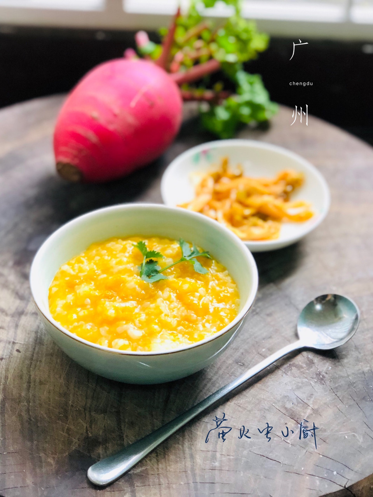

# 南瓜粥

## 📋 基本資訊 / Recipe Overview
- **料理名稱**：南瓜粥
- **原始標題**：南瓜粥
- **素食流派 / Diet**：全素 Vegan
- **料理分類 / Category**：米食料理
- **來源平台 / Source**：[豆果美食 · 素食專區](https://www.douguo.com/cookbook/2414823.html)

## 🌿 食材及佐料清單 / Ingredients
- 南瓜 150g
- 清水 600ml

## 🍳 烹飪步驟 / Step-by-Step Cooking Steps
1. 南瓜一块
2. 大米和糙米一杯洗净
3. 南瓜切块备用
4. 大米➕南瓜放入锅里
5. 加入纯净水
6. 按照电饭锅里煮粥的水位
7. 选择煮粥，按开始1.30分钟
8. 出锅，带着微微甜甜的味道南瓜粥就煲好了
9. 就一点小咸菜，每一口都是幸福的感觉

---
*食譜歸檔時間：2026-08-21 · 來源：豆果美食 (www.douguo.com)*