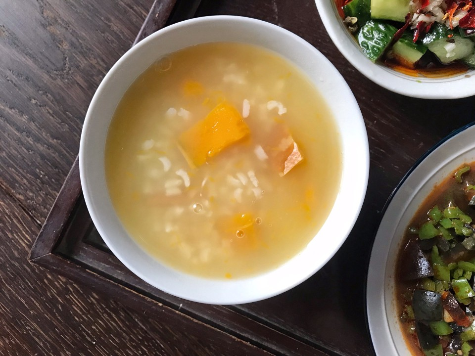

# 南瓜粥

## 📋 基本資訊 / Recipe Overview
- **料理名稱**：南瓜粥
- **原始標題**：南瓜粥
- **素食流派 / Diet**：全素 Vegan
- **料理分類 / Category**：米食料理
- **難易度 / Difficulty**：切墩(初级)
- **烹飪時間 / Cooking Time**：10-30分钟
- **來源平台 / Source**：[豆果美食 · 素食專區](https://www.douguo.com/cookbook/2302783.html)

## 📝 料理故事與簡介 / Story & Introduction
> 在外忙碌了一天，回到家，煮上一碗南瓜粥，香甜可口，食欲大增！

## 🌿 食材及佐料清單 / Ingredients
- 南瓜：适量
- 大米：一杯
- 清水：适量

## 🍳 烹飪步驟 / Step-by-Step Cooking Steps
1. 带皮南瓜洗净，切成粒备用。
2. 大米一杯备用。
3. 水开后，放入大米，不断搅拌，防止粘锅。
4. 放入南瓜。
5. 煮开后，盖上高压锅盖，上汽后转小火煮15分钟。
6. 一碗香甜可口的南瓜粥做好了。

## 💡 大廚美味秘訣 / Chef's Tips
- 根据自己高压锅的脾气，掌握时间长短。

---
*食譜歸檔時間：2026-08-20 · 來源：豆果美食 (www.douguo.com)*