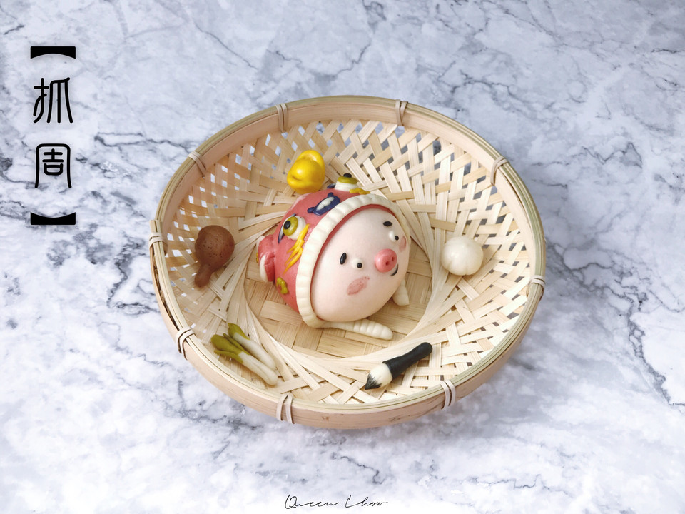

# 卡通馒头&卡通包 抓周馒头----致爱的宝贝

## 📋 基本資訊 / Recipe Overview
- **料理名稱**：卡通馒头&卡通包 抓周馒头----致爱的宝贝
- **原始標題**：卡通馒头&卡通包 抓周馒头----致爱的宝贝
- **素食流派 / Diet**：全素 Vegan
- **料理分類 / Category**：家常蔬食 / 經典熱菜
- **來源平台 / Source**：[豆果美食 · 素食專區](https://www.douguo.com/cookbook/2329359.html)

## 🌿 食材及佐料清單 / Ingredients
- 面团
- 色粉
- 工具

## 🍳 烹飪步驟 / Step-by-Step Cooking Steps
1. 60g白面团调成肉色，滚圆放馒头纸
2. 红色面团擀扁，切出半圆，直径12cm左右
3. 如图包裹
4. 花纹用肉色细条
5. 【耳朵】如图装饰
6. 眼睛是大小不同三个圆形，分别白色、绿色、黑色叠加粘合，眉毛是蓝色和白色
7. 面部表情
8. 虎头眼睛下面用黄色细条，每边三根粘合
9. 白色长条用刮板压出压痕，围绕在虎头上
10. 虎头的鼻子用蓝色和白色如图装饰
11. 绿色小花
12. 抓周的五样东西或者自由发挥，为了可爱就很迷你了
13. 分别是毛笔代表读书人，葱--聪明，蒜--善于计算，鸡腿--有口福，一生不愁吃穿，元宝---未来富有
14. 尺寸基本在2cm左右，发酵至1.5倍大，蒸制，出炉

---
*食譜歸檔時間：2026-08-20 · 來源：豆果美食 (www.douguo.com)*