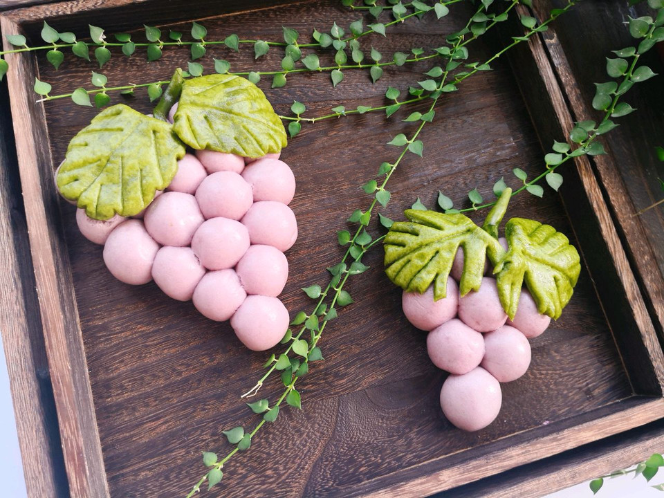

# 卡通馒头卡通包 万圣节南瓜小熊

## 📋 基本資訊 / Recipe Overview
- **料理名稱**：卡通馒头卡通包 万圣节南瓜小熊
- **原始標題**：【卡通馒头卡通包】万圣节南瓜小熊
- **素食流派 / Diet**：全素 Vegan
- **料理分類 / Category**：家常蔬食 / 經典熱菜
- **來源平台 / Source**：[豆果美食 · 素食專區](https://www.douguo.com/cookbook/2357808.html)

## 🌿 食材及佐料清單 / Ingredients
- 中筋面粉 200克
- 熟南瓜泥 70克
- 酵母 2克
- 水 45克
- 黑可可粉/竹炭粉 少许
- 细砂糖 10克

## 🍳 烹飪步驟 / Step-by-Step Cooking Steps
1. 南瓜泥与面粉、酵母、糖揉成光滑的黄色面团；少许面团加可可粉揉成深色。
2. 取黄色面团分成主体与小圆球耳鼻部件。
3. 主体包入馅料滚圆，顶部贴上两只小半圆耳朵，塑出憨态可掬的小熊脑袋。
4. 戴上小巧南瓜帽子，用深色面团点缀眼睛、鼻子和小恶魔翅膀。
5. 温水锅中发酵至1.5倍大，轻按缓慢回弹。
6. 大火烧开后转中火蒸13分钟，焖3分钟揭盖出锅。

## 💡 大廚美味秘訣 / Chef's Tips
- 卡通面团发酵不要过度，七八分发即可开火蒸，保持立体轮廓不塌陷。

---
*食譜歸檔時間：2026-08-20 · 來源：豆果美食 (www.douguo.com)*