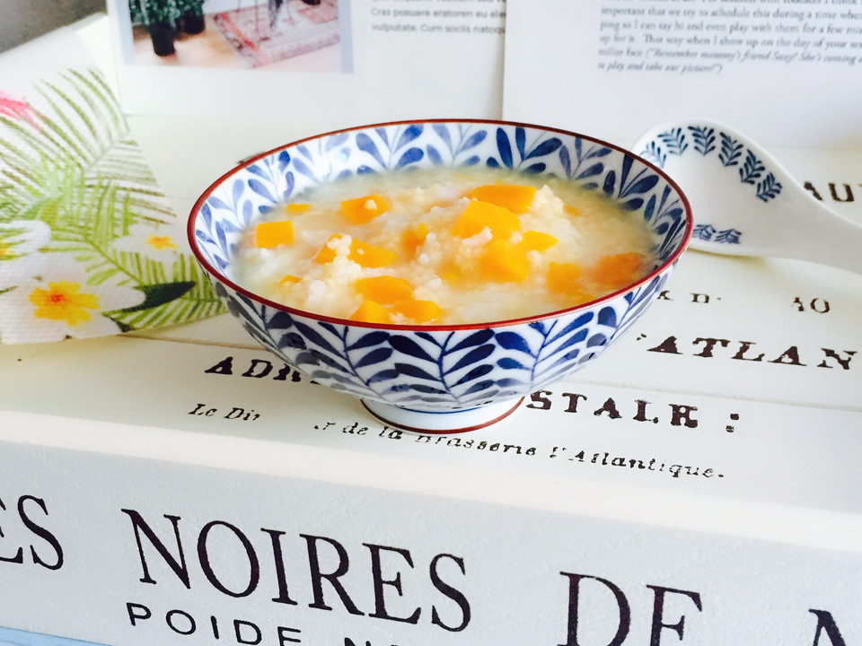

# 双米南瓜粥

## 📋 基本資訊 / Recipe Overview
- **料理名稱**：双米南瓜粥
- **原始標題**：双米南瓜粥
- **素食流派 / Diet**：全素 Vegan
- **料理分類 / Category**：米食料理
- **難易度 / Difficulty**：切墩(初级)
- **烹飪時間 / Cooking Time**：30~60分钟
- **來源平台 / Source**：[豆果美食 · 素食專區](https://www.douguo.com/cookbook/2303796.html)

## 📝 料理故事與簡介 / Story & Introduction
> 双米南瓜粥，搭配了大米和小米。营养丰富，清甜可口！

## 🌿 食材及佐料清單 / Ingredients
- 大米：30g
- 小米：20g
- 南瓜：1块
- 饮用水：600ml

## 🍳 烹飪步驟 / Step-by-Step Cooking Steps
1. 准备好食材
2. 南瓜清洗干净去皮去馕切小块备用
3. 大米淘洗一下倒入电饭煲内胆
4. 小米淘洗一下倒入电饭煲内胆
5. 南瓜倒入电饭煲内胆
6. 加入热水
7. 水量约600ml
8. 盖上电饭煲盖子摁煮粥功能键，约60分钟
9. 待时间到后再焖一会儿
10. 清甜可口的双米南瓜粥
11. 成品图一
12. 成品图二

## 💡 大廚美味秘訣 / Chef's Tips
- 1、大米、小米淘洗一下即可，以防营养流失
2、大米、小米各浸泡二十分钟

---
*食譜歸檔時間：2026-08-20 · 來源：豆果美食 (www.douguo.com)*