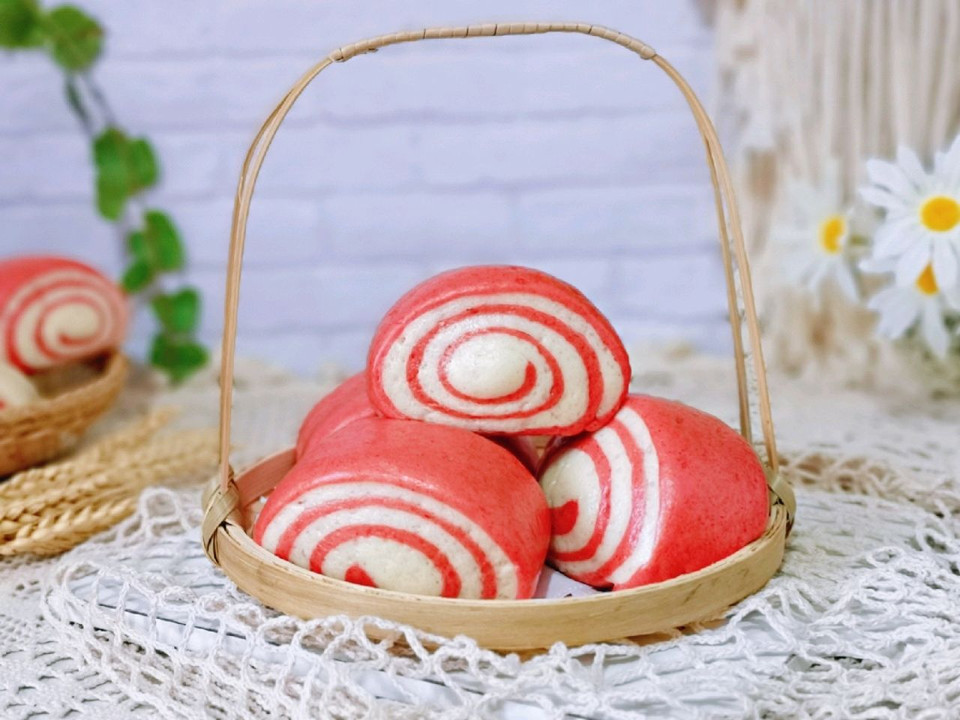

# 双色刀切馒头

## 📋 基本資訊 / Recipe Overview
- **料理名稱**：双色刀切馒头
- **原始標題**：双色刀切馒头
- **素食流派 / Diet**：全素 Vegan
- **料理分類 / Category**：家常蔬食 / 經典熱菜
- **來源平台 / Source**：[豆果美食 · 素食專區](https://www.douguo.com/cookbook/2362961.html)

## 🌿 食材及佐料清單 / Ingredients
- 中筋面粉 500克
- 糖 15克
- 酵母 4克
- 温水(25-30度) 250
- 红曲粉 2克

## 🍳 烹飪步驟 / Step-by-Step Cooking Steps
1. 准备食材并称重，糖的量可以根据个人喜好增减，不喜欢也可以不放。
2. 首先将面粉，奶粉，细砂糖放入面包机桶中用筷子搅拌一下。
3. 中间挖个坑，加入酵母粉，再加入温水。(水量根据实际情况增减，因为不同品牌的面粉吸水性不同，可以预留一部分水，后续根据需要添加)
4. 启动机器揉面一个程序。
5. 揉好的面团取出一半，剩下的加入红曲粉，继续揉均匀。
6. 取出揉好的面团，揉光滑，放入大碗中。
7. 白色的面团同样揉光滑，放入器具中。
8. 入蒸烤箱进行发酵，35度发酵40分钟。(室温发酵也可以，但是一定要保持面团的湿度）
9. 取出发酵好的面团，发酵完成的状态，全部是蜂窝状，取出两个颜色的面团排气，揉至光滑，盖上保鲜膜醒10分钟。
10. 醒好的面团用擀面杖擀成大面皮，两个颜色擀成同样大，之后叠加再一起，卷起来，什么颜色在外面可以根据个人喜好来决定，我是一半红色再外面，一半白色再外面。
11. 卷好的长卷，用切刀切出等份的馒头胚，用手稍微整形一下。
12. 依次做好，放入蒸格中，并间隔距离，可以把切下来的两头做成玫瑰花形状。
13. 入蒸烤箱二次发酵，35度发酵20分钟。
14. 发酵好的馒头胚是原来的两倍大，这时可以蒸啦！鲜嫩纯蒸15分钟，用蒸锅也可以。(蒸好的馒头切记不要立刻开门，焖3分钟再打开)
15. 香甜松软的双色馒头出锅啦～
16. 外表细腻，比买的好吃多啦～香甜松软的馒头，做法比面包简单，好吃不上火。
17. 做法简单，健康无添加。喜欢吃面食的一定不能错过，好吃又好看的馒头。
18. 口感非常好呦～细腻松软有嚼劲。

---
*食譜歸檔時間：2026-08-20 · 來源：豆果美食 (www.douguo.com)*