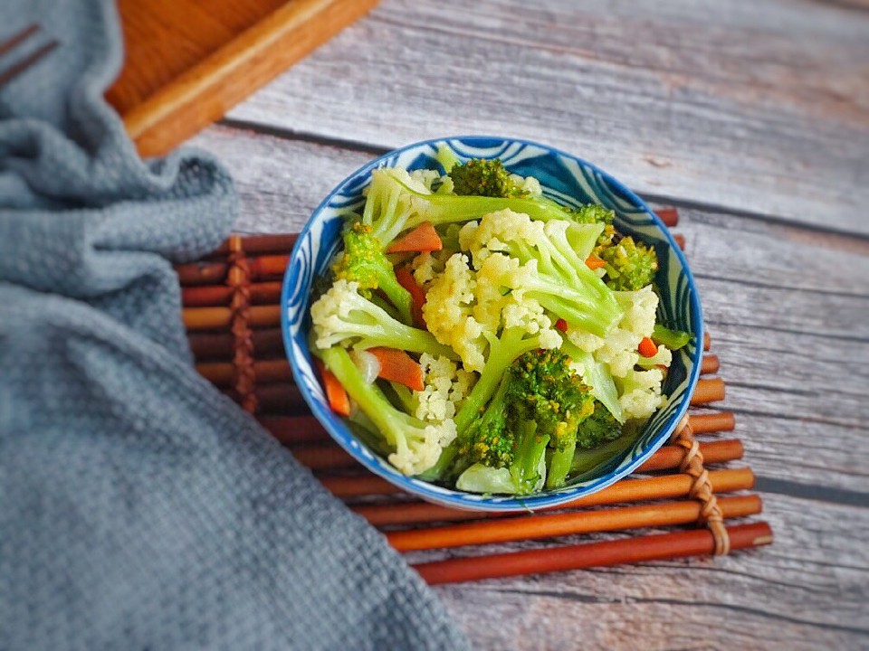

# 双色菜花

## 📋 基本資訊 / Recipe Overview
- **料理名稱**：双色菜花
- **原始標題**：双色菜花
- **素食流派 / Diet**：全素 Vegan
- **料理分類 / Category**：家常蔬食 / 經典熱菜
- **難易度 / Difficulty**：切墩(初级)
- **烹飪時間 / Cooking Time**：10~30分钟
- **來源平台 / Source**：[豆果美食 · 素食專區](https://www.douguo.com/cookbook/2071347.html)

## 📝 料理故事與簡介 / Story & Introduction
> 花菜的维生素C含量特别突出，每100克含量高达88毫克，比同类的白菜、油菜等多一倍以上，比芹菜、苹果多一倍。 

又因为独特的口感，是很多小朋友的最爱～

## 🌿 食材及佐料清單 / Ingredients
- 西兰花：一棵
- 有机花菜：半棵
- 蒜：2瓣
- 胡萝卜：少许
- 盐：少许

## 🍳 烹飪步驟 / Step-by-Step Cooking Steps
1. 有机花菜、西兰花、胡萝卜洗切好后放入锅中，加水焯煮2-3分钟后捞出备用
2. 热锅冷油，下蒜瓣炒香
3. 下焯煮过的菜花与胡萝卜，加少许盐，大火翻炒均匀后加水煮至食材全熟
水量大概没过食材一半
4. 双色菜花，一盘满足两种菜花需求
5. 好看又好吃
6. 还没加盐的宝宝，就不要加盐咯
加水煮熟就可以了

---
*食譜歸檔時間：2026-08-20 · 來源：豆果美食 (www.douguo.com)*