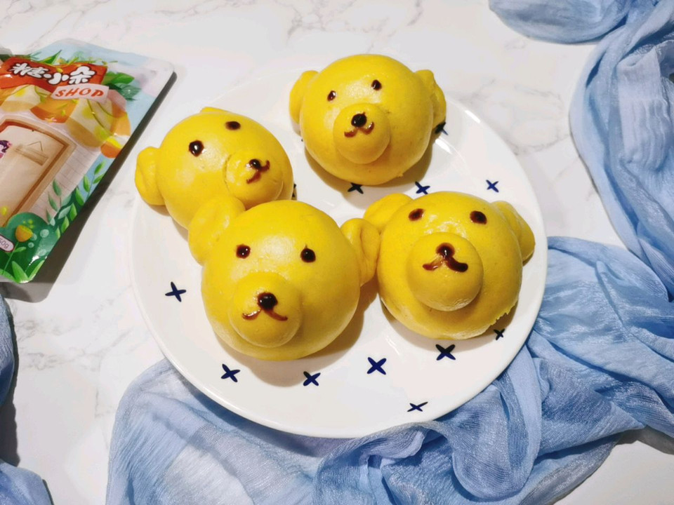

# 可爱的小熊馒头

## 📋 基本資訊 / Recipe Overview
- **料理名稱**：可爱的小熊馒头
- **原始標題**：可爱的小熊馒头
- **素食流派 / Diet**：全素 Vegan
- **料理分類 / Category**：烘焙麵點 / 點心
- **難易度 / Difficulty**：切墩(初级)
- **烹飪時間 / Cooking Time**：1小时以上
- **來源平台 / Source**：[豆果美食 · 素食專區](https://www.douguo.com/cookbook/3080676.html)

## 📝 料理故事與簡介 / Story & Introduction
> 用南瓜泥和面给娃整个可爱的小熊馒头带出门踏青去吧！用了糖小朵零卡糖不怕娃龋齿了！

## 🌿 食材及佐料清單 / Ingredients
- 面粉：300克
- 南瓜泥：200克
- 酵母粉：3克
- 糖小朵零卡糖：10克
- 巧克力酱：少许

## 🍳 烹飪步驟 / Step-by-Step Cooking Steps
1. 南瓜去皮切块上锅蒸熟
2. 蒸熟的南瓜加入糖小朵零卡糖捣成泥晾至不烫手备用
3. 把南瓜泥倒入面粉中，加入酵母先用筷子给拌成没有干粉的状态下手揉
4. 揉成光滑的面团，盖上保鲜膜放进烤箱里发酵1小时
5. 发酵至大概两倍大
6. 扒开面团里面呈这样的蜂窝状就是发酵好的状态
7. 下手揉搓排气，搓成长条的剂子
8. 分层12份等大的剂子
9. 再取出2个剂子出来，分成30份的小剂子
10. 把剂子搓圆备用
11. 取一个大的剂子搓圆当小熊的头部再取3个小剂子分别当小熊的鼻子和耳朵。依次做好所有的小熊胚，再次醒发20分钟，上锅蒸20分钟焖3分钟开锅。
12. 蒸好的馒头
13. 用竹签或牙签蘸上巧克力酱画上小熊的眼睛和鼻子即可
14. 成品
15. 可爱的小熊

## 💡 大廚美味秘訣 / Chef's Tips
- 一定要等南瓜泥晾至不烫手了再放酵母，不然就把酵母菌烫死了，就发酵不了了。南瓜泥的含水量不一样，看自己的面团状态酌情加入少许清水。

---
*食譜歸檔時間：2026-08-20 · 來源：豆果美食 (www.douguo.com)*