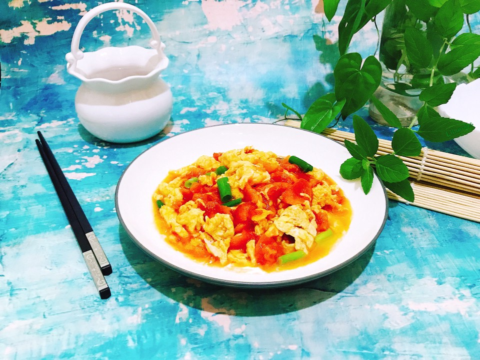

# 吃不腻的番茄炒蛋～我喜欢汁多酸酸甜甜的

## 📋 基本資訊 / Recipe Overview
- **料理名稱**：吃不腻的番茄炒蛋～我喜欢汁多酸酸甜甜的
- **原始標題**：吃不腻的番茄炒蛋～我喜欢汁多酸酸甜甜的
- **素食流派 / Diet**：蛋素 Ovo-Vegetarian
- **料理分類 / Category**：養生飲品 / 甜湯
- **來源平台 / Source**：[豆果美食 · 素食專區](https://www.douguo.com/cookbook/2332821.html)

## 🌿 食材及佐料清單 / Ingredients
- 鸡蛋 2个
- 番茄 1个
- 生抽 适量
- 糖 少许
- 香葱 适量
- 盐 适量
- 五香粉 少许
- 调料水 适量

## 🍳 烹飪步驟 / Step-by-Step Cooking Steps
1. 番茄去皮切块
2. 鸡蛋加调料水打散，炒嫩点盛出备用。
3. 番茄加生抽、五香粉、糖炒软，再加少许调料水炒至浓汁，然后放入炒好的鸡蛋。
4. 翻拌均匀，炒开，尝咸淡调盐，撒入香葱出锅。
5. 盛出
6. 嗯，不错！
7. 开动啦！

## 💡 大廚美味秘訣 / Chef's Tips
- 当然，汤汁多少随各人喜欢

---
*食譜歸檔時間：2026-08-21 · 來源：豆果美食 (www.douguo.com)*