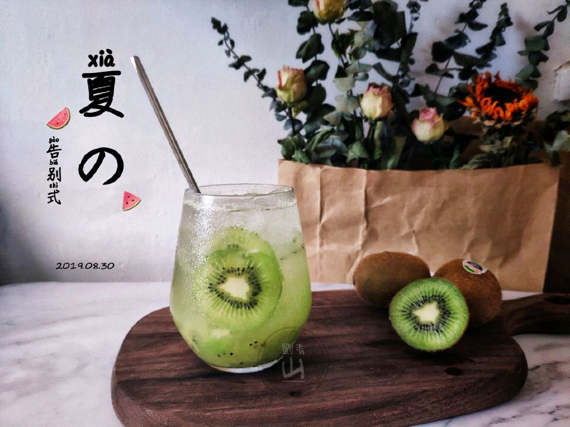

# 喝完这一杯，跟夏天说再见。

## 📋 基本資訊 / Recipe Overview
- **料理名稱**：喝完这一杯，跟夏天说再见。
- **原始標題**：喝完这一杯，跟夏天说再见。
- **素食流派 / Diet**：全素 Vegan
- **料理分類 / Category**：家常蔬食 / 經典熱菜
- **來源平台 / Source**：[豆果美食 · 素食專區](https://www.douguo.com/cookbook/2337350.html)

## 🌿 食材及佐料清單 / Ingredients
- 葡萄 八粒
- 奇异果 一个
- 汤力水或雪碧 ¾杯
- 茶水 ¼杯
- 冰块 适量

## 🍳 烹飪步驟 / Step-by-Step Cooking Steps
1. 葡萄去皮去籽
2. 用勺子把葡萄捣碎
3. 奇异果留两片。其他捣碎。
4. 事先放凉的绿茶
5. 加入冰块。再倒入绿茶和气泡水。
6. 放入切片奇异果装饰即可

## 💡 大廚美味秘訣 / Chef's Tips
- 加入绿茶喝起来更清新哦

---
*食譜歸檔時間：2026-08-21 · 來源：豆果美食 (www.douguo.com)*