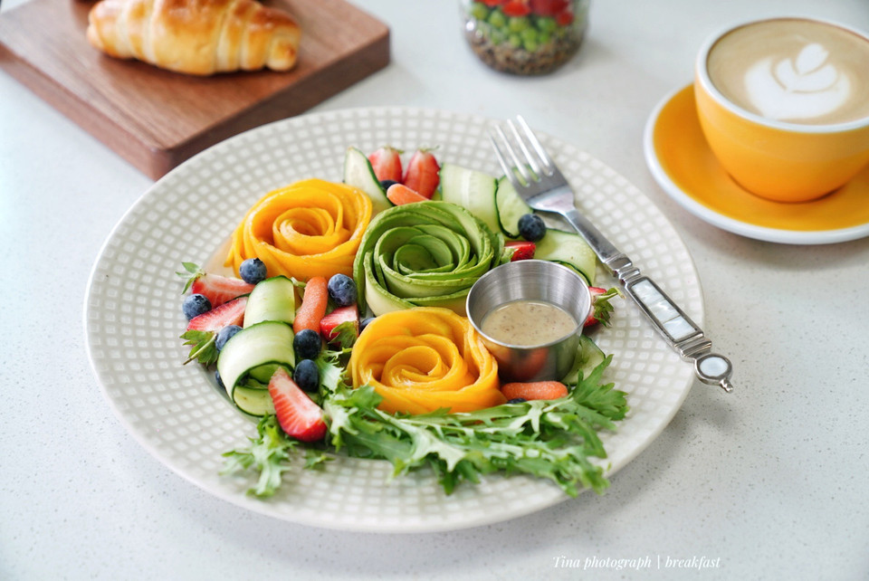

# 夏日花园沙拉

## 📋 基本資訊 / Recipe Overview
- **料理名稱**：夏日花园沙拉
- **原始標題**：夏日花园沙拉
- **素食流派 / Diet**：全素 Vegan
- **料理分類 / Category**：涼拌前菜 / 輕食
- **來源平台 / Source**：[豆果美食 · 素食專區](https://www.douguo.com/cookbook/3089143.html)

## 🌿 食材及佐料清單 / Ingredients
- 牛油果 1/2个
- 芒果 1个
- 黄瓜 1/3根
- 草莓 2个
- 蓝莓 数十粒
- 小萝卜 4根
- 苦苣 1/3颗
- 焙煎芝麻口味沙拉酱 适量

## 🍳 烹飪步驟 / Step-by-Step Cooking Steps
1. 准备以上食材
2. 芒果去皮，切片
3. 按图上所示，将芒果片推开
4. 卷起
5. 一朵芒果花就做好了
6. 牛油果同样制作
7. 卷成花花放入盘中
8. 黄瓜切片
9. 草莓切块，和苦苣一起摆入盘中
10. 黄瓜片、蓝莓、小胡萝卜码入盘中，放上沙拉酱即可
11. 这样的一盘是不是特别好看呢
12. 春夏日的美好沙拉
13. 搭配咖啡面包
14. 一起做起来吧

---
*食譜歸檔時間：2026-08-21 · 來源：豆果美食 (www.douguo.com)*