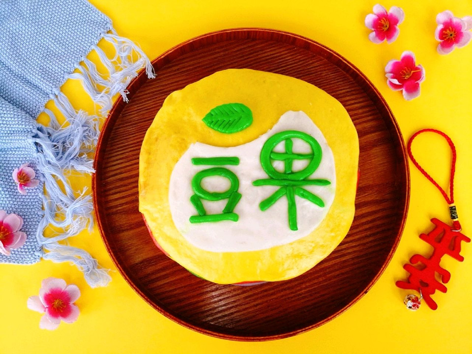

# 多彩“豆果”

## 📋 基本資訊 / Recipe Overview
- **料理名稱**：多彩“豆果”
- **原始標題**：多彩“豆果”
- **素食流派 / Diet**：全素 Vegan
- **料理分類 / Category**：家常蔬食 / 經典熱菜
- **來源平台 / Source**：[豆果美食 · 素食專區](https://www.douguo.com/cookbook/2389960.html)

## 🌿 食材及佐料清單 / Ingredients
- 中筋面粉 480克
- 酵母 4克
- 白砂糖 10克
- 玉米油 10克
- 果蔬粉 适量
- 清水 238克

## 🍳 烹飪步驟 / Step-by-Step Cooking Steps
1. 清水少量多次加入面粉，不要一次性倒入，根据面粉的吸水量适当增减。
2. 用筷子搅拌成雪花状。
3. 揉至看不见干粉加入玉米油，继续揉面，可以手揉，也可以厨师机或者面包机揉面哈。
4. 揉成光滑的面团。
5. 分割出两个120克的面团，一个加入抹茶粉揉匀，再分出一个15克的绿色面团，剩余的分成2等份放一边备用，另外一个原色不加果蔬粉，同样分出一个15克左右的面团，剩余的同样分成2等份放一边备用。。
6. 剩余的面团分割成三等份。
7. 3等份的面团分别加入不同的果蔬粉，其中一个用南瓜粉，剩余的面团用什么果蔬粉都可以，如果觉得有点干可以稍微加点水。
8. 全部面团再次揉成光滑的面团。没有操作的盖湿毛巾放一边备用，天气热的话放冰箱冷藏。
9. 每个颜色的面团全部分成3等份。
10. 往里折叠，每个揉70次左右。
11. 除了2个15克的面团之外，其他面团全部擀成圆形。
12. 擀开的面团一层一层的铺上，类似做千层蛋糕。
13. 最后一层用黄色。
14. 预留的15克绿色面团取出一小块擀平，做出叶子形状，放一边备用。
15. 剩余的面团搓成长条，搓细一些，不要太粗，再切成长短不一的小长条，用来摆出“豆果”两个字。
16. 预留的15克原色面团擀开，稍微修剪。
17. 把修剪后的白色面片先取在黄色面胚上，再用绿色小长条摆出“豆果”字样，叶子放在顶部，这样生面胚就操作完成了。
18. 把面胚醒发至1.5倍大，水开蒸25分钟，关火后焖5分钟再取出就完成了。
19. 来张切面图，颜色漂亮，有木有像天上的彩虹啊？
20. “豆果”千层馒头就做好了。

---
*食譜歸檔時間：2026-08-21 · 來源：豆果美食 (www.douguo.com)*