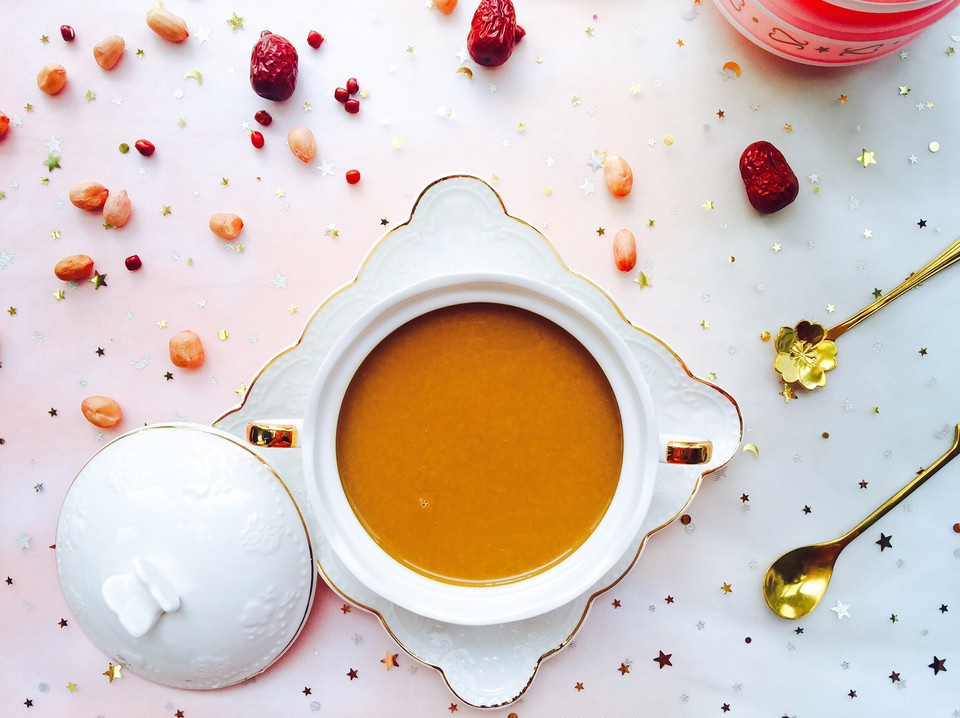

# 女神必喝—五红汤

## 📋 基本資訊 / Recipe Overview
- **料理名稱**：女神必喝—五红汤
- **原始標題**：女神必喝—五红汤
- **素食流派 / Diet**：全素 Vegan
- **料理分類 / Category**：湯品羹湯
- **來源平台 / Source**：[豆果美食 · 素食專區](https://www.douguo.com/cookbook/2353051.html)

## 🌿 食材及佐料清單 / Ingredients
- 红枣 30克
- 红豆 25克
- 花生 25克
- 枸杞 10克
- 红糖 一勺
- 清水 1000毫升

## 🍳 烹飪步驟 / Step-by-Step Cooking Steps
1. 食材全家福！用料不要贪多，多了打出来的会是米糊，不是豆浆了！
2. 红豆，花生前一晚用水泡上！
3. 枣去核，切成枣片！
4. 把红枣，红豆，花生，枸杞一起放入豆浆机！加入1000毫升清水！
5. 启动“湿豆”功能，如果你的豆子没有提前泡，就启用“干豆”功能！每家豆浆机不一样的，大家按照自己的操作就好！十八分钟就好了！
6. 用滤网滤掉豆渣，豆浆会很爽滑！
7. 加入一勺红糖！
8. 美美的能量五红汤，你get了么？

## 💡 大廚美味秘訣 / Chef's Tips
- 用料不要贪多，多了打出来的会是米糊，不是豆浆了哦！

---
*食譜歸檔時間：2026-08-21 · 來源：豆果美食 (www.douguo.com)*