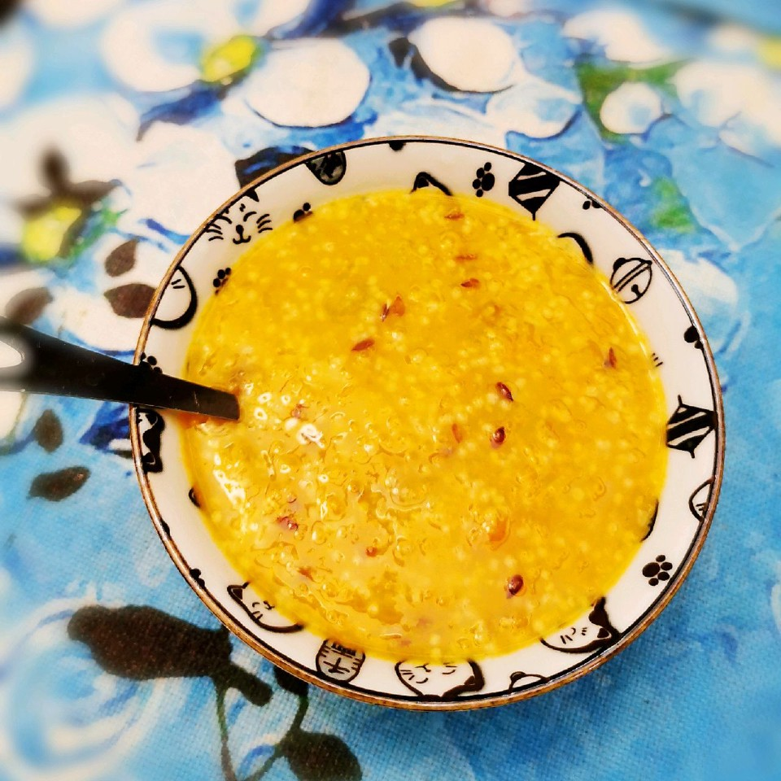

# 好喝又养生的小米南瓜粥

## 📋 基本資訊 / Recipe Overview
- **料理名稱**：好喝又养生的小米南瓜粥
- **原始標題**：好喝又养生的小米南瓜粥
- **素食流派 / Diet**：全素 Vegan
- **料理分類 / Category**：米食料理
- **來源平台 / Source**：[豆果美食 · 素食專區](https://www.douguo.com/cookbook/2483515.html)

## 🌿 食材及佐料清單 / Ingredients
- 小米 70g
- 绿豆 25g
- 亚麻籽 10g
- 绿皮老南瓜 400g

## 🍳 烹飪步驟 / Step-by-Step Cooking Steps
1. 将70g小米加上25g绿豆、10g亚麻籽放入压力锅中，用清水淘洗几遍洗干净。
2. 淘洗完将水分滤掉，再加入1300g清水。（如果用砂锅炖粥，水还需多加300g，因为砂锅需要炖半个小时以上，水份挥发得厉害）
3. 挑选一块绿皮南瓜（得出的经验，绿皮南瓜甜度更高，口感也更绵软），南瓜去皮和瓤后重约400g。
4. 南瓜切块，也放入压力锅中，盖上盖子，大火煮至压力锅上汽。
5. 上汽后赶紧改至小火，定好时间，小火压10分钟就可以出锅了。
6. 稍微搅拌南瓜就和粥均匀的混在了一起，小米的米油和亚麻籽的胶质让粥的口感也更稠厚醇香了。

---
*食譜歸檔時間：2026-08-21 · 來源：豆果美食 (www.douguo.com)*