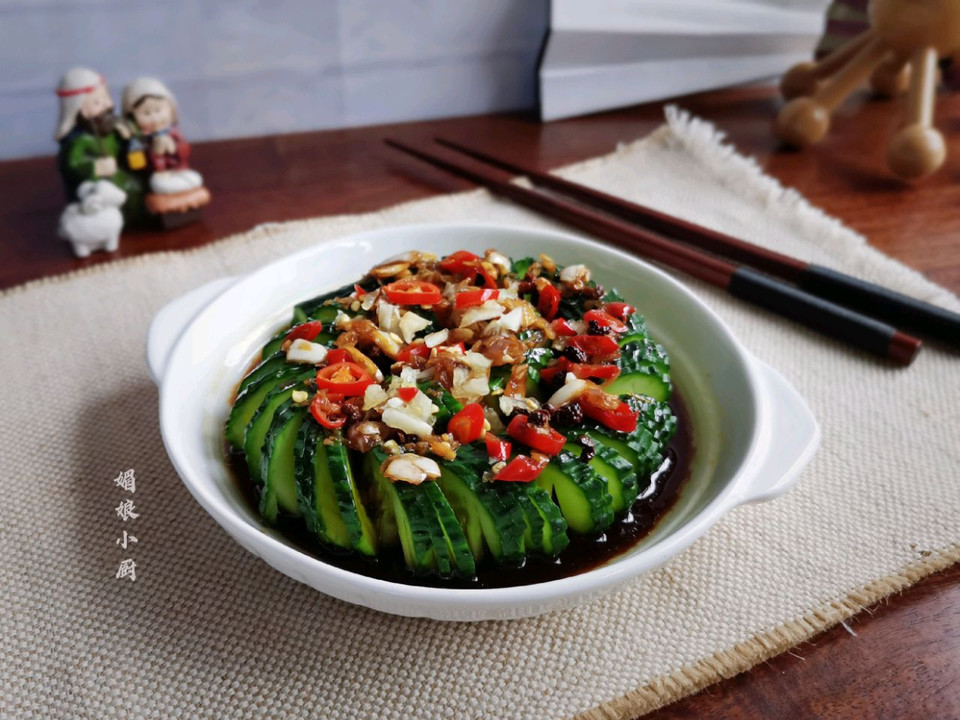

# 好看好吃的蓑衣黄瓜

## 📋 基本資訊 / Recipe Overview
- **料理名稱**：好看好吃的蓑衣黄瓜
- **原始標題**：好看好吃的蓑衣黄瓜
- **素食流派 / Diet**：全素 Vegan
- **料理分類 / Category**：家常蔬食 / 經典熱菜
- **來源平台 / Source**：[豆果美食 · 素食專區](https://www.douguo.com/cookbook/2531706.html)

## 🌿 食材及佐料清單 / Ingredients
- 黄瓜 1根
- 蒜 3瓣
- 红小米辣 2个
- 生抽 2勺
- 香醋 1勺
- 凉白开 2勺
- 花生油 3勺
- 花椒 10粒
- 白糖 半勺

## 🍳 烹飪步驟 / Step-by-Step Cooking Steps
1. 备食材
2. 蓑衣黄瓜是腌制生食的，所以清洗黄瓜要仔细，我是用清水先冲洗，再用盐搓洗，然后再用小毛刷流水下仔细地刷洗一遍，沥干多余水分，放置菜板上，切去两头，并在黄瓜的两侧各放一根筷子
3. 菜刀呈45度斜角切下，切到筷子处停下，黄瓜不会被切断，从头到尾将整根黄瓜切薄片，不能切断，片片相连。再将黄瓜翻面，同样的切法再次从头到尾切薄片，切到筷子处停，每一片黄瓜都相连。翻面也就是说接触菜板的那面翻转上来。
4. 经过两次切片的黄瓜片片相连不断，蓑衣黄瓜这样就算切好了，可以拉伸至原本黄瓜的两倍长
5. 切好的蓑衣黄瓜绕圈码入大小合适的深盘里
6. 蒜瓣捣碎，红小米辣斜切圈，蒜末、红辣圈都留1/3，其余的装容器里
7. 加入2勺生抽、1勺香醋、2勺凉白开、少许白糖调匀
8. 再热锅加油，小火炸花椒油，浇入调料汁碗内，搅拌均匀，晾凉
9. 料汁均匀地浇在蓑衣黄瓜上
10. 最后再撒入预留的蒜末和红辣椒圈，提亮成菜的色泽。盖上保鲜膜，放置冰箱冷藏腌制半小时以上，等黄瓜入味即可。

## 💡 大廚美味秘訣 / Chef's Tips
- ▽ Tips

黄瓜的挑选：黄瓜尽量挑直溜，两头粗细均匀些的，颜色翠绿，掂起来手感硬，分量沉，这样的黄瓜水分足，口感更脆爽，瓜蒂新鲜，表面带有小刺，用手轻轻一碰就会掉落下来，这样的黄瓜是比较新鲜的。

生抽的量比较足，够咸味了就不用再加盐，生抽和醋不需要固定比例，按自己口味调整，适合自家口味就可。

蓑衣黄瓜的腌制时间要够，黄瓜才会入味，我一般腌制半小时，黄瓜可保持翠绿的颜色，腌制时间太久了会变黄，不过味道也会更香浓，所以时间可自行调整。

---
*食譜歸檔時間：2026-08-21 · 來源：豆果美食 (www.douguo.com)*