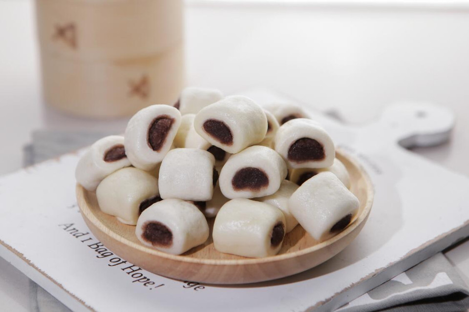

# 宝宝超级爱吃夹心小馒头

## 📋 基本資訊 / Recipe Overview
- **料理名稱**：宝宝超级爱吃夹心小馒头
- **原始標題**：宝宝超级爱吃夹心小馒头
- **素食流派 / Diet**：全素 Vegan
- **料理分類 / Category**：烘焙麵點 / 點心
- **難易度 / Difficulty**：切墩(初级)
- **烹飪時間 / Cooking Time**：15-30 分鐘
- **來源平台 / Source**：[豆果美食 · 素食專區](https://www.douguo.com/cookbook/3001480.html)

## 📝 料理故事與簡介 / Story & Introduction
> 如果您还在为宝宝吃饭发愁，来试试这款夹心小馒头，蓬松暄软又好吃，新手也能学会零失败 ！宝宝超级爱吃！

## 🌿 食材及佐料清單 / Ingredients
- 易小焙南方馒头自发粉：200g
- 水：100g
- 易小焙红豆沙：160g

## 🍳 烹飪步驟 / Step-by-Step Cooking Steps
1. 易小焙南方馒头自发粉中加入100g水，搅拌成絮状；
2. 再揉成光滑的面团；
3. 静置松弛10min;
4. 搓成长条状，分成4个小面剂子；
5. 揉成光滑的面团；
6. 然后在揉成长条状；
7. 擀成长方形的面片；
8. 40g豆沙揉成长条状，放置擀开的面团上；
9. 接口处捏住；
10. 切成等大的小剂子；
11. 放入蒸锅中，冷水上锅，上汽后蒸6min关火，焖3min，然后迅速拿起锅盖；
12. 夹心小馒头做好啦！
13. 里面满满的豆沙馅料，豆沙馅也可以自己制作的哦！
14. 蓬松暄软又好吃！宝宝一口一个！

## 💡 大廚美味秘訣 / Chef's Tips
- 1.豆沙馅可以自己制作哦！ 
2.这款馒头自发粉里面有酵母，无需再放酵母，超级好用，口感筋道；

---
*食譜歸檔時間：2026-08-20 · 來源：豆果美食 (www.douguo.com)*