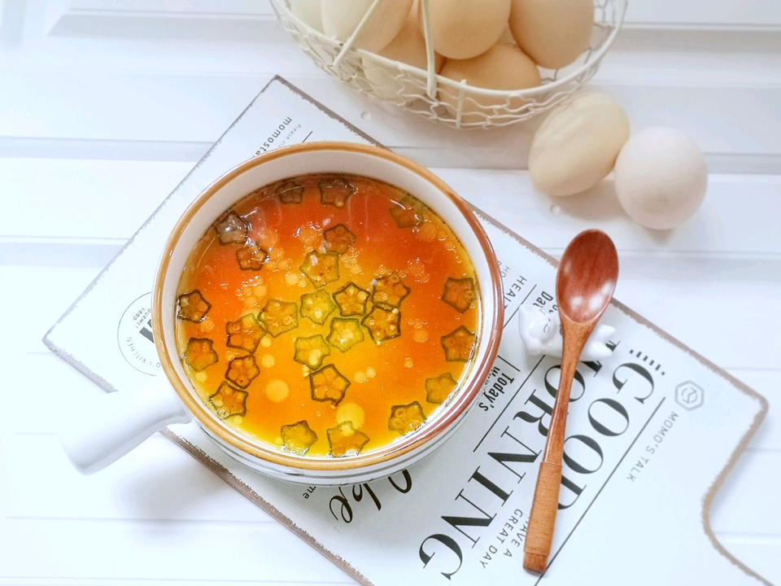

# 小星星——秋葵蒸蛋

## 📋 基本資訊 / Recipe Overview
- **料理名稱**：小星星——秋葵蒸蛋
- **原始標題**：小星星——秋葵蒸蛋
- **素食流派 / Diet**：蛋素 Ovo-Vegetarian
- **料理分類 / Category**：家常蔬食 / 經典熱菜
- **難易度 / Difficulty**：切墩(初级)
- **烹飪時間 / Cooking Time**：10~30分钟
- **來源平台 / Source**：[豆果美食 · 素食專區](https://www.douguo.com/cookbook/3000029.html)

## 📝 料理故事與簡介 / Story & Introduction
> 经过小长假，这减肥计划华丽丽的失败啦！假期大吃大喝，无辣不欢，所以今天要来做一碗看起来十分小清新，吃起来很清爽的秋葵蒸蛋。秋葵一直是小朋友们喜欢的蔬菜，营养价值非常高，做出来的菜品颜值也很高！

## 🌿 食材及佐料清單 / Ingredients
- 鸡蛋：3个
- 秋葵：1根
- 水：适量
- 酱油：少许
- 麻油：少许

## 🍳 烹飪步驟 / Step-by-Step Cooking Steps
1. 鸡蛋打入容器中，蛋壳备用
2. 鸡蛋打散，加入6次半个蛋壳的水量混合均匀
3. 加入少许盐调味
4. 过筛
5. 秋葵清洗干净
6. 切薄片，放在蛋液里
7. 锅中放水，水开放容器
8. 盖上扎好孔的锡纸
9. 盖盖中火蒸12分钟
10. 出锅淋上麻油和生抽
11. 美美的秋葵蒸蛋
12. 超级滑嫩

## 💡 大廚美味秘訣 / Chef's Tips
- 蒸的时间会因为容器大小薄厚、深度、火力等不同而有影响，需要自己根据情况做适当调整。

---
*食譜歸檔時間：2026-08-20 · 來源：豆果美食 (www.douguo.com)*