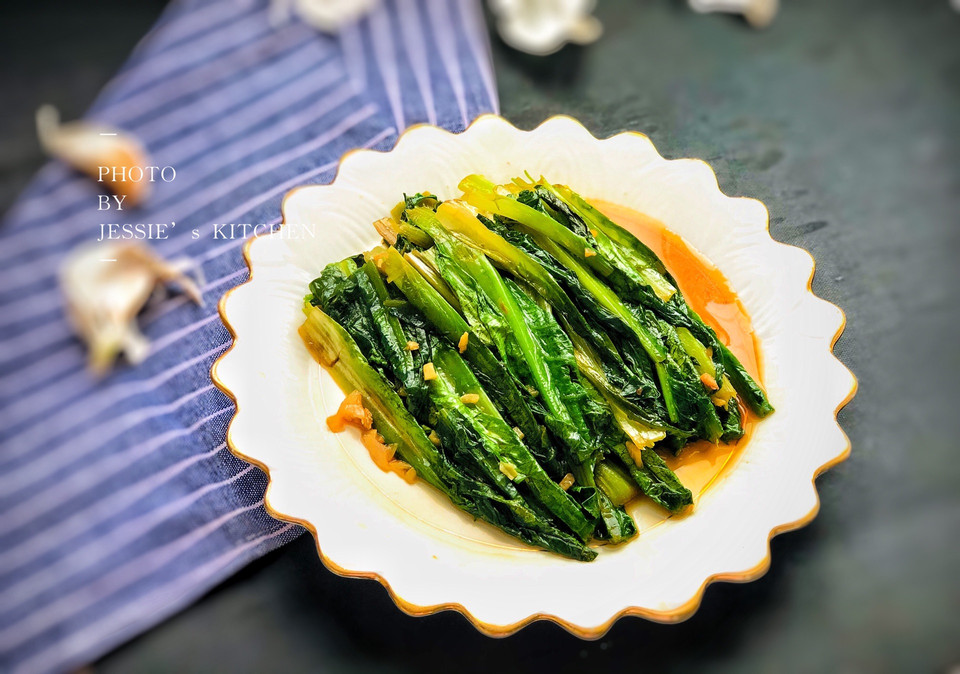

# 小白必学快手菜——蒜蓉油麦菜

## 📋 基本資訊 / Recipe Overview
- **料理名稱**：小白必学快手菜——蒜蓉油麦菜
- **原始標題**：小白必学快手菜——蒜蓉油麦菜
- **素食流派 / Diet**：全素 Vegan
- **料理分類 / Category**：家常蔬食 / 經典熱菜
- **來源平台 / Source**：[豆果美食 · 素食專區](https://www.douguo.com/cookbook/2400892.html)

## 🌿 食材及佐料清單 / Ingredients
- 油麦菜 2颗
- 大蒜 5瓣
- 生抽 20ml
- 蚝油 1勺

## 🍳 烹飪步驟 / Step-by-Step Cooking Steps
1. 油麦菜洗净掰成两段
2. 大蒜切末
3. 锅里放少许底油，油温稍热时放入大蒜末，小火煸炒。
4. 慢慢炒到这个程度，有点焦黄
5. 放入油麦菜大火翻炒
6. 看到菜明显变软时，加入生抽
7. 加入蚝油
8. 大火翻炒，蚝油和生抽都有盐，所以不再额外放盐
9. 成品图
10. 成品图

## 💡 大廚美味秘訣 / Chef's Tips
- 一定要大火，快速翻炒，保证青菜脆嫩的口感。

---
*食譜歸檔時間：2026-08-21 · 來源：豆果美食 (www.douguo.com)*