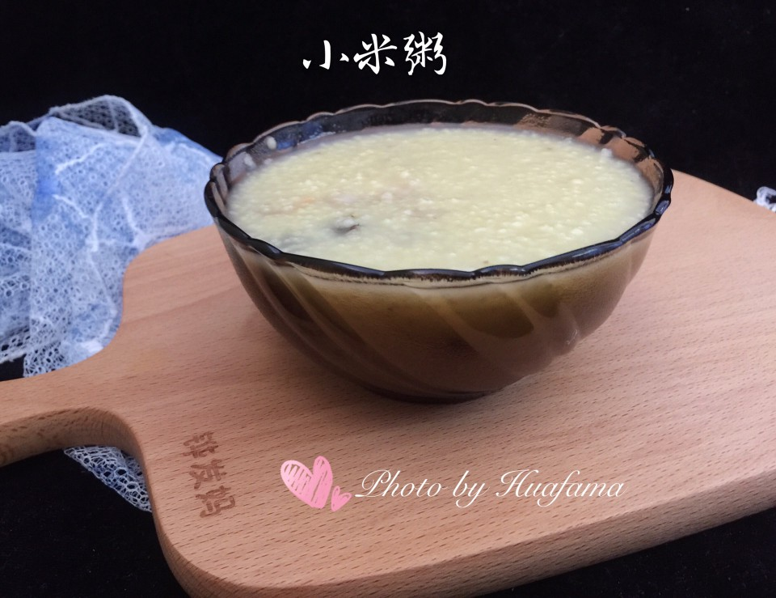

# 小米粥

## 📋 基本資訊 / Recipe Overview
- **料理名稱**：小米粥
- **原始標題**：小米粥
- **素食流派 / Diet**：全素 Vegan
- **料理分類 / Category**：米食料理
- **難易度 / Difficulty**：切墩(初级)
- **烹飪時間 / Cooking Time**：30~60分钟
- **來源平台 / Source**：[豆果美食 · 素食專區](https://www.douguo.com/cookbook/2492595.html)

## 📝 料理故事與簡介 / Story & Introduction
> 小米粥
小米是一种我们常见的谷类食物，小米的营养非常丰富，含丰富的维生素和矿物质，很多人喜欢用来煮粥，小米不仅对胃对肠道好还容易吸收。

## 🌿 食材及佐料清單 / Ingredients
- 小米（大约2把米）：50g至60g左右
- 清水：1000ml
- 橄榄油或玉米油：几滴

## 🍳 烹飪步驟 / Step-by-Step Cooking Steps
1. 准备好所有食材、海参要先泡发好的哦（想知道如何处理海参，请参考我的另一个菜谱）
2. 小米50g，煮出来有三碗的量，喜欢浓稠的粥，用至60g。
3. 小米用清水淘洗2次，用筷子搅搅就可以
4. 锅内加1000克水，煮开
5. 倒入洗好的小米，加几滴玉米油，大火烧开
6. 转中小火，㸓去上面浮沫，第一次漂浮的沫去掉就可以，中小火，煮20分钟左右
7. 煮到米汤有粘稠感，好多泡泡为止，关火。即可
8. 这样小米粥就煮好了
9. 成品图：一碗小米粥
10. 成品图：营养又美味的小米粥
11. 成品图：营养又美味的小米粥
12. 成品图：营养又美味的小米粥
13. 成品图：还可以做成营养又美味的海参小米粥
14. 成品图：还可以做成营养又美味的海参小米粥

## 💡 大廚美味秘訣 / Chef's Tips
- 小米粥可以用砂锅熬更香哦！

---
*食譜歸檔時間：2026-08-20 · 來源：豆果美食 (www.douguo.com)*