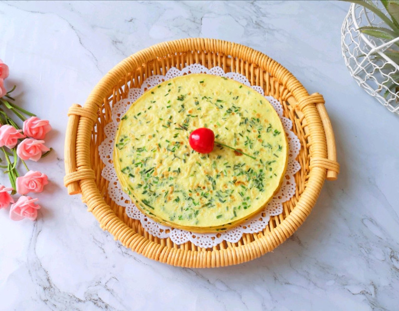

# 小蒜鸡蛋饼

## 📋 基本資訊 / Recipe Overview
- **料理名稱**：小蒜鸡蛋饼
- **原始標題**：小蒜鸡蛋饼
- **素食流派 / Diet**：蛋素 Ovo-Vegetarian
- **料理分類 / Category**：家常蔬食 / 經典熱菜
- **來源平台 / Source**：[豆果美食 · 素食專區](https://www.douguo.com/cookbook/3096939.html)

## 🌿 食材及佐料清單 / Ingredients
- 小蒜 26g
- 鸡蛋 3个
- 面粉 50g
- 纯净水 100g
- 盐 3g
- 食用油 适量

## 🍳 烹飪步驟 / Step-by-Step Cooking Steps
1. 野小蒜择洗干净。
2. 切碎。
3. 将小蒜碎放入大碗里，打入鸡蛋。
4. 搅拌均匀。
5. 加入面粉。
6. 搅拌至无干粉。
7. 加入纯净水搅拌均匀。
8. 放盐。
9. 搅拌均匀，静置一会儿备用。
10. 平底锅刷上一层食用油烧热，倒入一勺小蒜鸡蛋液，来回晃一下锅子，使蛋液均匀的铺在锅底。
11. 定型以后翻面，两面都煎至金黄色就熟了。
12. 味道特别香。
13. 好吃到停不下来！

## 💡 大廚美味秘訣 / Chef's Tips
- 鸡蛋饼：

---
*食譜歸檔時間：2026-08-20 · 來源：豆果美食 (www.douguo.com)*