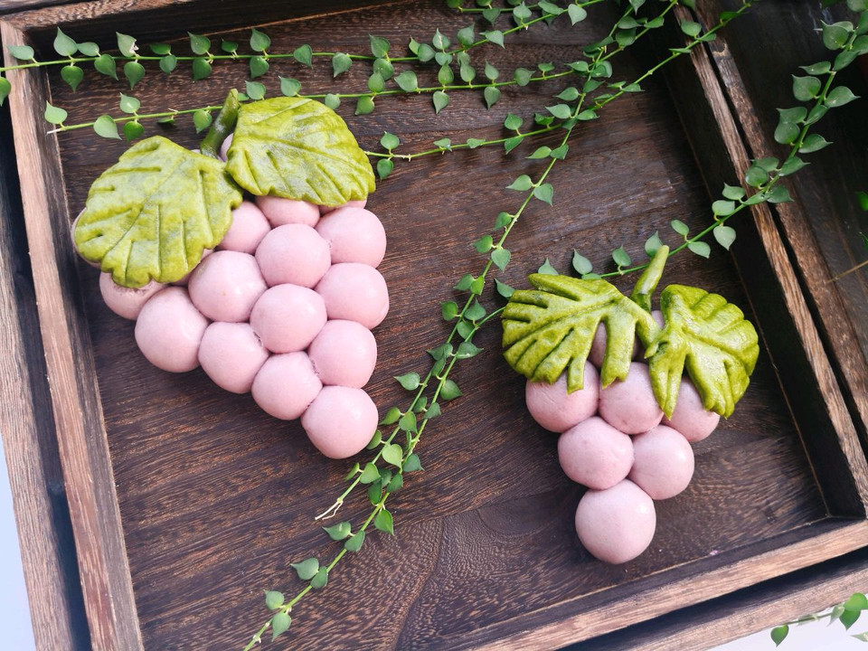

# 小麦仁豆浆西米露

## 📋 基本資訊 / Recipe Overview
- **料理名稱**：小麦仁豆浆西米露
- **原始標題**：#洗手作羹汤#小麦仁豆浆西米露
- **素食流派 / Diet**：全素 Vegan
- **料理分類 / Category**：家常蔬食 / 經典熱菜
- **來源平台 / Source**：[豆果美食 · 素食專區](https://www.douguo.com/cookbook/2356333.html)

## 🌿 食材及佐料清單 / Ingredients
- 黄豆 50克
- 小麦仁 30克
- 小西米 30克
- 冰糖 适量
- 清水 适量

## 🍳 烹飪步驟 / Step-by-Step Cooking Steps
1. 黄豆和小麦仁提前浸泡4小时，放入破壁机中加入足量清水打成浓香豆浆并过滤。
2. 另起一锅足量水烧开，下入西米大火煮10分钟至中间剩小白点，关火焖15分钟至完全透明，捞出过凉开水沥干。
3. 将煮好的浓豆浆加热煮沸，加入适量冰糖搅拌融化。
4. 碗中盛入适量Q弹西米，冲入热豆浆搅拌均匀即可享用。

## 💡 大廚美味秘訣 / Chef's Tips
- 西米煮好后过凉水能保持颗粒晶莹剔透且弹性十足。

---
*食譜歸檔時間：2026-08-20 · 來源：豆果美食 (www.douguo.com)*