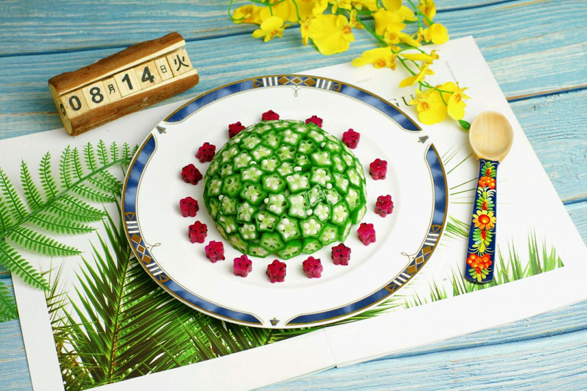

# 当秋葵遇上土豆–秋葵土豆泥，减脂营养餐

## 📋 基本資訊 / Recipe Overview
- **料理名稱**：当秋葵遇上土豆–秋葵土豆泥，减脂营养餐
- **原始標題**：当秋葵遇上土豆–秋葵土豆泥，减脂营养餐
- **素食流派 / Diet**：奶素 Lacto-Vegetarian
- **料理分類 / Category**：家常蔬食 / 經典熱菜
- **難易度 / Difficulty**：切墩(初级)
- **烹飪時間 / Cooking Time**：10~30分钟
- **來源平台 / Source**：[豆果美食 · 素食專區](https://www.douguo.com/cookbook/2332034.html)

## 📝 料理故事與簡介 / Story & Introduction
> 秋葵是一种蔬菜，他含有多种维生素矿物质和适量的膳食纤维，他比其他的蔬菜粘液质含量高，含有丰富的植物多糖，因而抗氧化的作用比较强，对于提高免疫力，抗肿瘤，以及保护心脑血管都有一定的保健作用，并且在秋葵中含有比较丰富的果胶，他属于一种可溶性的膳食纤维，对于维持血糖，润肠通便，健脾胃都是有很好的帮助的。 

土豆的营养价值和功效更是多的不胜枚举，感兴趣的小伙伴自己查阅，我就不一一赘述了。

## 🌿 食材及佐料清單 / Ingredients
- 土豆：1个(约300克)
- 秋葵：9个
- 奶粉：40克
- 盐：2克
- 胡椒粉：0.5克

## 🍳 烹飪步驟 / Step-by-Step Cooking Steps
1. 准备主要材料
2. 土豆切丁，沸水中煮熟，要煮的面一些，中间可以尝尝软硬度
3. 秋葵入沸水煮1分钟断生，不要煮的太烂，没法切
4. 捞出秋葵凉水里冷却，切成0.7厘米的小块，不要切的过薄，容易断掉
5. 捞出土豆丁，控干水分
6. 将土豆丁捣成泥，加奶粉、盐、胡椒粉拌匀
7. 将秋葵一片片贴在圆形的小碗中，密实一些
8. 土豆泥填入其中
9. 拿一个大碟子盖在小碗上，再倒扣过来
10. 做好了
11. 我点缀了一些火龙果
12. 土豆泥中添加了奶粉，变的格外香滑
13. 觉得秋葵太淡的话可以撒一些生抽提提味儿

## 💡 大廚美味秘訣 / Chef's Tips
- 土豆泥加入奶粉是这道菜的关键，加了奶粉的土豆泥有浓浓的奶香味儿。

---
*食譜歸檔時間：2026-08-20 · 來源：豆果美食 (www.douguo.com)*