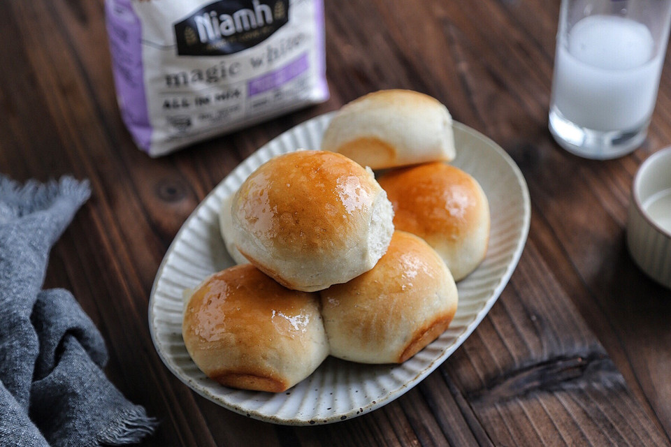

# 快手小面包

## 📋 基本資訊 / Recipe Overview
- **料理名稱**：快手小面包
- **原始標題**：快手小面包
- **素食流派 / Diet**：全素 Vegan
- **料理分類 / Category**：烘焙麵點 / 點心
- **難易度 / Difficulty**：配菜(中级)
- **烹飪時間 / Cooking Time**：1小时以上
- **來源平台 / Source**：[豆果美食 · 素食專區](https://www.douguo.com/cookbook/2986861.html)

## 📝 料理故事與簡介 / Story & Introduction
> Niamh的魔法面包粉，据说用面粉加水揉成面团就行，什么别的材料都不用加，也不用出膜，简直就是为烘焙小白和繁忙上班族准备的，实在是太太太方便了～
我用的这款是白面包粉，里面除了小麦粉还有小麦纤维，做出的面包口感偏干和硬，虽然没有精面粉加了黄油鸡蛋等做出来的那么香软，但胜在具有生理营养优势，而且低脂低热量哦～

## 🌿 食材及佐料清單 / Ingredients
- Niamh白面包粉：250g
- 水：170g
- 蜂蜜：1勺
- 水：半勺

## 🍳 烹飪步驟 / Step-by-Step Cooking Steps
1. 面粉和水搅拌均匀
2. 用手揉搓
3. 揉至无干粉状态再继续揉15分钟
4. 放碗里盖上保鲜膜发酵约40分钟
5. 继续揉匀，排气
6. 然后搓成大小一致的圆球，放入烤盘
7. 放入烤箱上层，下层放一盆热水，进行第二次发酵，40度，30分钟
8. 发酵完成后取出
9. 刷一层蜂蜜水
10. 放入180度烤箱，烤约18分钟
11. 出烤箱后再刷一层蜂蜜水即可

## 💡 大廚美味秘訣 / Chef's Tips
- 水不要一次加入，一边加一边揉，等面粉慢慢吸收水分～
因为想看看懒人面包粉可以懒成什么地步，所以没用厨师机、用面包机之类的，连揉面垫都没用，直接用手在碗里揉的，如果有时间的可以揉久一点，揉至扩展阶段即可
这款面包粉做出的面包口感偏干和硬，类似面包店里那种无糖或低糖的白方包，斋吃会有点乏味，可以沾果酱或夹香肠、培根之类的一起吃

---
*食譜歸檔時間：2026-08-20 · 來源：豆果美食 (www.douguo.com)*