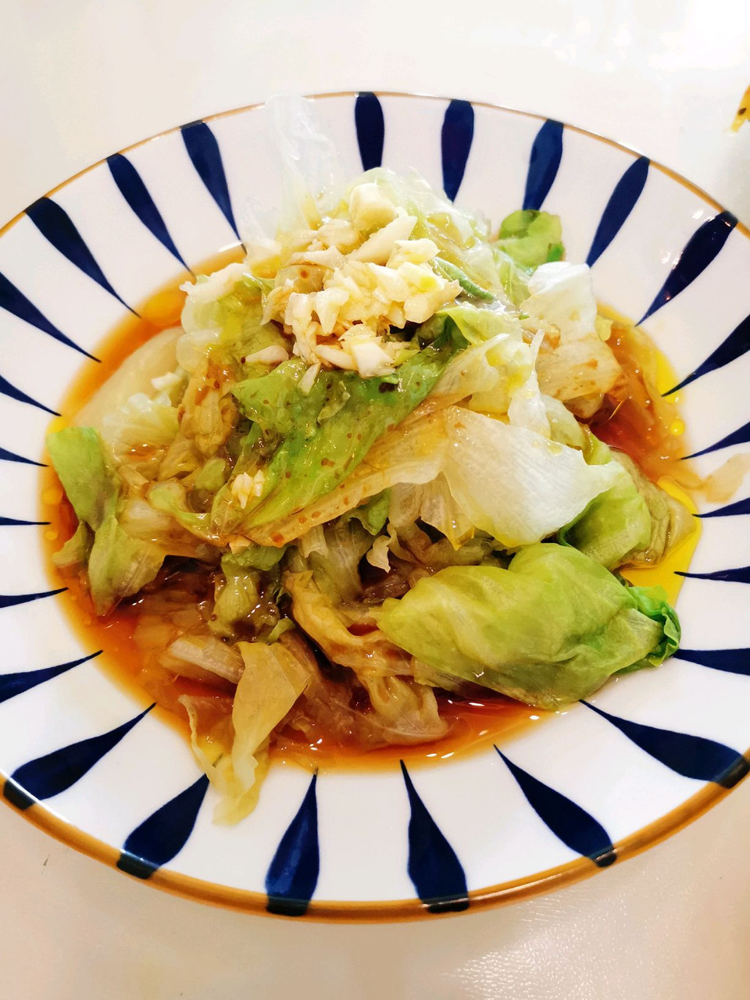

# 快手菜—白灼生菜

## 📋 基本資訊 / Recipe Overview
- **料理名稱**：快手菜—白灼生菜
- **原始標題**：快手菜—白灼生菜
- **素食流派 / Diet**：全素 Vegan
- **料理分類 / Category**：涼拌前菜 / 輕食
- **難易度 / Difficulty**：切墩(初级)
- **烹飪時間 / Cooking Time**：10分钟左右
- **來源平台 / Source**：[豆果美食 · 素食專區](https://www.douguo.com/cookbook/3013206.html)

## 📝 料理故事與簡介 / Story & Introduction
> 生菜营养含量丰富，含有大量β胡萝卜素、抗氧化物、维生素B1、B6 、维生素E、维生素C，还有大量膳食纤维素和微量元素如镁、磷、钙及少量的铁、铜、锌。常吃生菜可以加强蛋白质和脂肪的消化与吸收，改善肠胃的血液循环。
原来生菜的营养价值这么高，生菜做起来也特别简单，白水一煮就能吃，也是涮火锅特别受欢迎的一个菜，白灼生菜同样也非常简单，白灼的做法基本适合所有的蔬菜！

## 🌿 食材及佐料清單 / Ingredients
- 生菜：200克
- 生抽：1勺
- 盐：适量
- 蒜末：10克
- 植物油：适量

## 🍳 烹飪步驟 / Step-by-Step Cooking Steps
1. 生菜洗净焯水，水中加盐可以让颜色更漂亮
2. 加生抽、盐，蒜末切好放最上边
3. 锅中烧油，油热浇在蒜末上就可以开吃啦

---
*食譜歸檔時間：2026-08-20 · 來源：豆果美食 (www.douguo.com)*