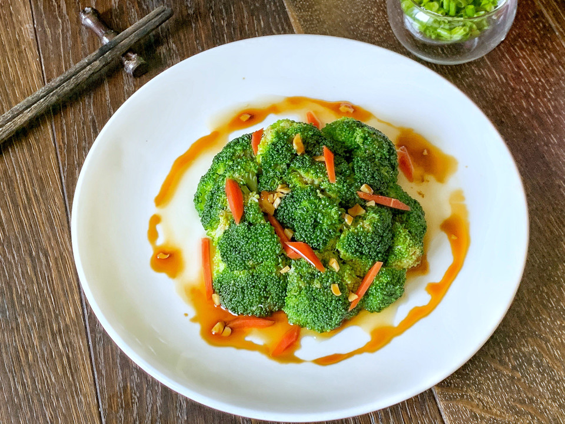

# 快手菜：凉拌西兰花

## 📋 基本資訊 / Recipe Overview
- **料理名稱**：快手菜：凉拌西兰花
- **原始標題**：快手菜：凉拌西兰花
- **素食流派 / Diet**：全素 Vegan
- **料理分類 / Category**：涼拌前菜 / 輕食
- **來源平台 / Source**：[豆果美食 · 素食專區](https://www.douguo.com/cookbook/3113496.html)

## 🌿 食材及佐料清單 / Ingredients
- 西兰花 1个
- 食用油 1勺
- 胡萝卜 少许
- 大蒜 1瓣
- 生抽 1勺
- 香醋 2勺
- 蚝油 3勺

## 🍳 烹飪步驟 / Step-by-Step Cooking Steps
1. 西兰花掰成小块
2. 盐水浸泡半小时，洗净
3. 沸水中加入少许食用油
4. 放入西兰花煮至断生
5. 捞出沥干水分
6. 放凉后装盘
7. 生抽，蚝油，香醋按1:3:2比例混合均匀备用
8. 可放入适量蒜末
9. 将调味料拌匀淋在西兰花上
10. 上桌

---
*食譜歸檔時間：2026-08-21 · 來源：豆果美食 (www.douguo.com)*