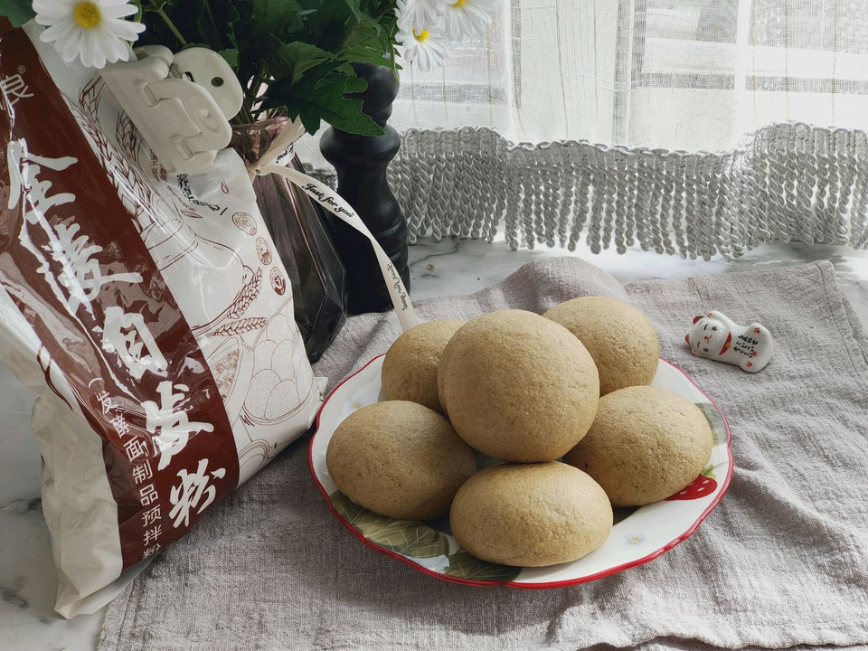

# 快手馒头

## 📋 基本資訊 / Recipe Overview
- **料理名稱**：快手馒头
- **原始標題**：快手馒头
- **素食流派 / Diet**：全素 Vegan
- **料理分類 / Category**：烘焙麵點 / 點心
- **來源平台 / Source**：[豆果美食 · 素食專區](https://www.douguo.com/cookbook/3001418.html)

## 🌿 食材及佐料清單 / Ingredients
- 全麦自发粉 250克
- 温水 150克左右

## 🍳 烹飪步驟 / Step-by-Step Cooking Steps
1. 把全麦自发粉跟温水一并倒入厨师机桶内，搅打成团。
2. 取出，揉成一团。
3. 均分成7小份，再次揉光滑。
4. 放入蒸烤箱，38度发酵40-50分钟。
5. 发酵至1.5-2倍大，设置100度蒸20分钟即可。
6. 蒸好后，等五分钟再开箱，我们的馒头就做好了。
7. 成品照
8. 成品照
9. 成品照

---
*食譜歸檔時間：2026-08-21 · 來源：豆果美食 (www.douguo.com)*