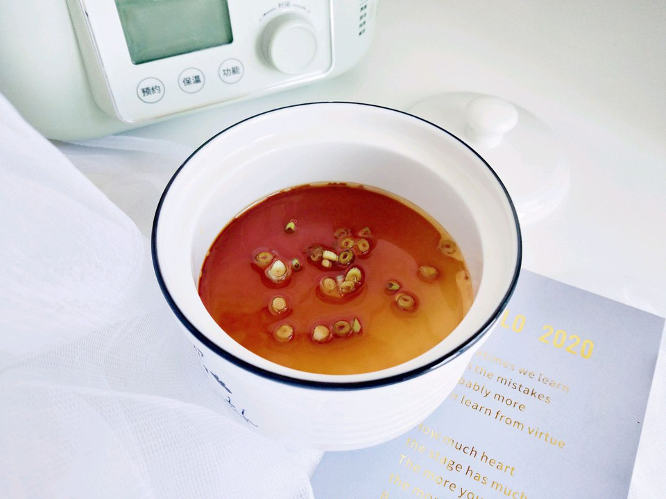

# 快手鸡蛋羹

## 📋 基本資訊 / Recipe Overview
- **料理名稱**：快手鸡蛋羹
- **原始標題**：快手鸡蛋羹
- **素食流派 / Diet**：蛋素 Ovo-Vegetarian
- **料理分類 / Category**：湯品羹湯
- **難易度 / Difficulty**：切墩(初级)
- **烹飪時間 / Cooking Time**：10~30分钟
- **來源平台 / Source**：[豆果美食 · 素食專區](https://www.douguo.com/cookbook/2974919.html)

## 📝 料理故事與簡介 / Story & Introduction
> 鸡蛋羹是我小时候最喜欢吃的一道菜，与其说是一道菜不如说是我儿时解馋的一道小吃！

好吃的蛋羹并不难做，因为只要用心美食会给你不一样的惊喜的！

## 🌿 食材及佐料清單 / Ingredients
- 鸡蛋（去壳）：110g
- 温水：165g
- 食盐：1.5g
- 生抽：1勺
- 香油：半勺
- 葱花：适量

## 🍳 烹飪步驟 / Step-by-Step Cooking Steps
1. 温水中加入食盐混合融化。
2. 打散的全蛋液导入温水中混合均匀。
3. 蛋液过筛2～3次最佳。
4. 盖上盖子或者是盖上一个碗。
5. 放入上汽后的北鼎电蒸锅内。
6. 北鼎电蒸锅蒸8分钟，不要开盖焖3分钟。
7. 戴上隔热手套后取出。
8. 浇上生抽，香油和葱花就可以食用了。

## 💡 大廚美味秘訣 / Chef's Tips
- 1 . 要想蛋羹没有孔洞必须要注意用温水，还有蛋和水的比例不要错，这里给出的比例参考是1:1.5。

2 . 过筛不建议省略，因为这是蛋羹口感顺滑的关键。

3 . 用北鼎电蒸锅蒸蛋羹很是方便，不用看管就可以静享受美食了。

---
*食譜歸檔時間：2026-08-20 · 來源：豆果美食 (www.douguo.com)*