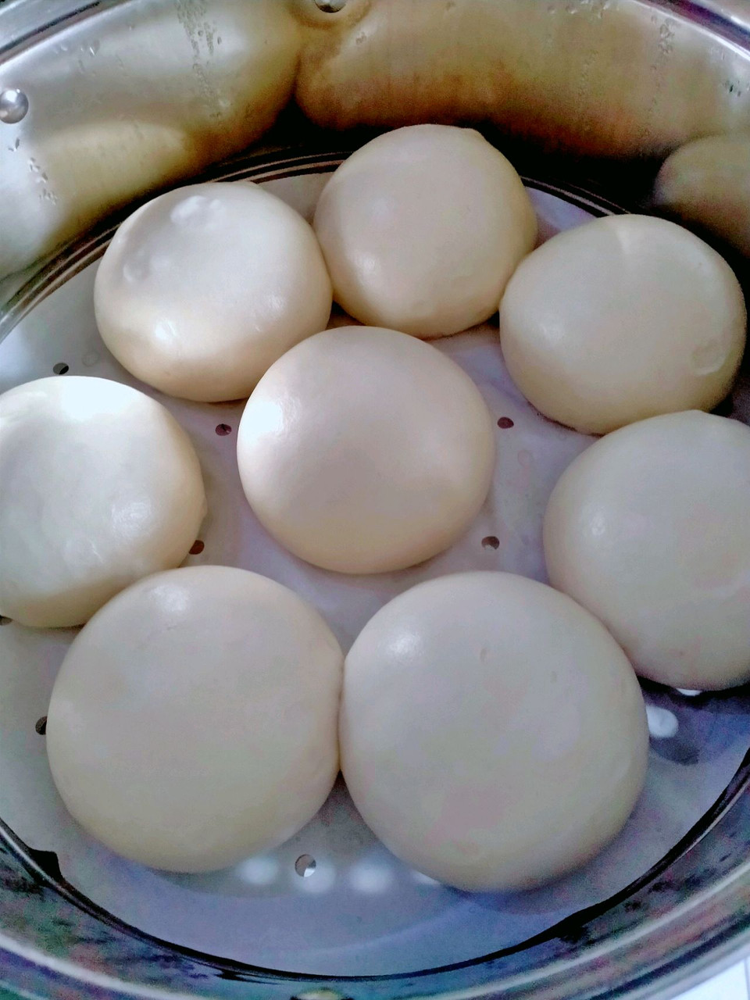

# 手揉馒头

## 📋 基本資訊 / Recipe Overview
- **料理名稱**：手揉馒头
- **原始標題**：手揉馒头
- **素食流派 / Diet**：奶素 Lacto-Vegetarian
- **料理分類 / Category**：烘焙麵點 / 點心
- **難易度 / Difficulty**：切墩(初级)
- **烹飪時間 / Cooking Time**：30~60分钟
- **來源平台 / Source**：[豆果美食 · 素食專區](https://www.douguo.com/cookbook/3055574.html)

## 📝 料理故事與簡介 / Story & Introduction
> 很多人说蒸不好馒头，其实没那么复杂，就是揉面和发酵问题，面揉光，蒸出来馒头就光滑，发酵到位，柔软，过度蒸好回缩，所以新手，咱们使用一发制作，一发制作同样更适合卡通造型馒头，用冷水揉面，不用温水，不管你是不是在寒冷的冬天，因为手揉的过程会使面团发酵，尤其制作卡通馒头，手慢的，前面发酵了，后面还没整形好，所以必须是冷水，手慢的，还可以把先做好的放温度低点的地方，全部做好再统一发酵，对于发酵的时间，没有固定时间，在没有发酵箱的家里，咱们做好的馒头，开始摸着都是比较实的，发酵好，摸着变软即可，不需要两倍大，然后冷水下锅蒸，中小火烧开，转中大火蒸12-15分钟，根据馒头大小，小12分，大15分，如果馒头发酵的比较大，已经发酵完成，那么就不要冷水下锅蒸，需要把水烧开再蒸，不管包子还是馒头，蒸好关火焖3-4分钟，可以避免热胀冷缩！一发制作馒头柔软细腻，想吃戗面馒头那样的，可以二发，就是面团混合好发酵两倍大，再排气揉光，中途可以撒些干粉揉进去，比较有嚼劲！

## 🌿 食材及佐料清單 / Ingredients
- 面粉：520克
- 酵母：5克
- 白糖：15克
- 盐：2克
- 猪油或者无味油：15克
- 水或者牛奶：250克

## 🍳 烹飪步驟 / Step-by-Step Cooking Steps
1. 除面粉外其他先混合，然后倒入面粉混合
2. 揉光，一大坨揉不动，对呀，咱们女生真的揉不动，那么就揪小块揉光再混合成大坨揉均匀！必须很光滑柔软那种，然后直接分剂子整形，可以搓长条，刀切馒头，也可以做成圆馒头，圆馒头制作，面团向中间折叠揉光再搓椭圆形，蒸好会扁下去，所以要椭圆形
3. 刀切的，切面没气孔！
4. 这是50克的圆馒头
5. 95克的
6. 全部做好放锅里发酵，我的是两倍，一倍做出来这里的一半，发酵好开始蒸，请看好上面发酵说明！
7. 蒸好的状态
8. 95克的，面团揉光，才能水光肌！
9. 50克的
10. 圆馒头一定要椭圆形，蒸好就扁了，很多人说馒头不白，尽量多揉揉面，就是大白馒头了
11. 细腻柔软的组织！
12. 馒头跟辣腐乳很配哟！尤其桂林腐乳！

---
*食譜歸檔時間：2026-08-20 · 來源：豆果美食 (www.douguo.com)*