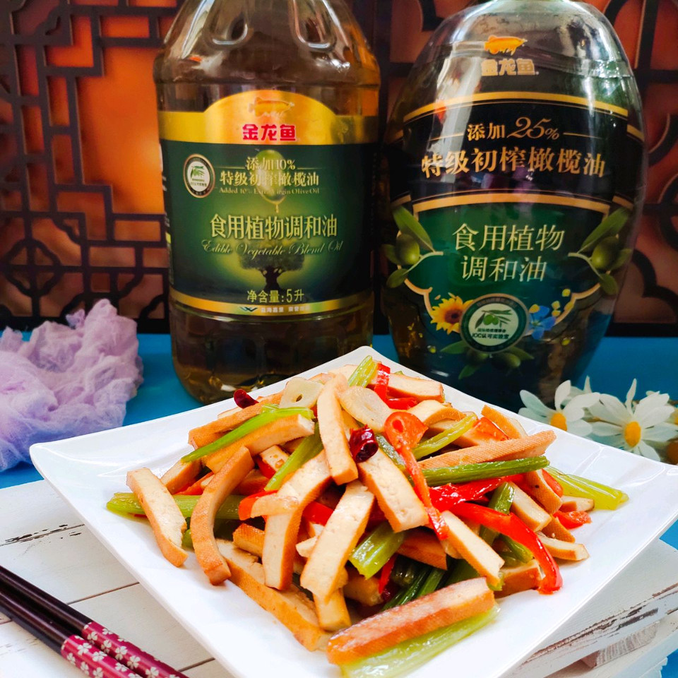

# 新春菜肴 _ 芹菜炒香干

## 📋 基本資訊 / Recipe Overview
- **料理名稱**：新春菜肴 _ 芹菜炒香干
- **原始標題**：新春菜肴 | 芹菜炒香干
- **素食流派 / Diet**：全素 Vegan
- **料理分類 / Category**：家常蔬食 / 經典熱菜
- **難易度 / Difficulty**：切墩(初级)
- **烹飪時間 / Cooking Time**：10分钟左右
- **來源平台 / Source**：[豆果美食 · 素食專區](https://www.douguo.com/cookbook/3055995.html)

## 📝 料理故事與簡介 / Story & Introduction
> 过年了，大鱼大肉的准备的特别多，来上一份素菜，绝对抢光盘。芹菜炒香干——口感爽脆，鲜香嫩滑，好吃简单易上手，芹菜的清脆，配合香干的嚼劲和香嫩，这次选择的是金龙鱼添加25%特级初榨橄榄油食用植物调和油，每一滴特级初榨橄榄油含单不饱和脂肪酸及橄榄多酚。经检测不饱和脂肪酸≥82%，每瓶产品中添加25%特级初榨橄榄油，是地中海膳食健康的精髓，有“液体黄金”之美誉。

## 🌿 食材及佐料清單 / Ingredients
- 芹菜：2根
- 香干：2片
- 金龙鱼添加25%特级初榨橄榄油食用植物调和油：20ml
- 红椒：1个
- 蚝油：1勺
- 干辣椒：4个
- 大蒜：2瓣
- 鸡精：1勺
- 盐：1克

## 🍳 烹飪步驟 / Step-by-Step Cooking Steps
1. 把食材准备好。
2. 芹菜择去芹菜叶切成细条状，豆干切长条，红椒去籽后切成长条，大蒜切片，干红椒切段备用。
3. 炒锅中倒入金龙鱼添加25%特级初榨橄榄油食用植物调和油。
4. 放入蒜片、干辣椒爆香。
5. 把切好的芹菜放入锅中进行翻炒。
6. 再把香干和红辣椒丝一同放在锅中进行翻炒。
7. 倒入蚝油。
8. 一勺盐。
9. 翻炒均匀后再倒入适量清水翻炒更入味。
10. 出锅前加入一勺鸡精翻炒均匀调味就好了。
11. 芹菜炒香干就做好了。口感爽脆，鲜香嫩滑，好吃简单易上手哦！
12. 虽然是一道十分家常的菜肴，在年夜饭上出现，脆嫩的芹菜配上香干，清爽解馋，下酒又下饭哦。

## 💡 大廚美味秘訣 / Chef's Tips
- 喜欢吃芹菜叶的可以不用择去，一同炒。

---
*食譜歸檔時間：2026-08-20 · 來源：豆果美食 (www.douguo.com)*