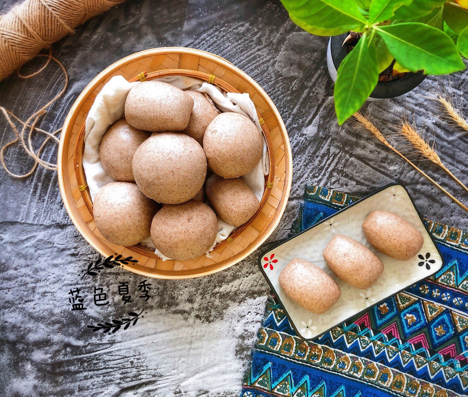

# 无糖无油全麦小馒头——吃点粗粮更健康

## 📋 基本資訊 / Recipe Overview
- **料理名稱**：无糖无油全麦小馒头——吃点粗粮更健康
- **原始標題**：无糖无油全麦小馒头——吃点粗粮更健康
- **素食流派 / Diet**：全素 Vegan
- **料理分類 / Category**：烘焙麵點 / 點心
- **難易度 / Difficulty**：切墩(初级)
- **烹飪時間 / Cooking Time**：1小时以上
- **來源平台 / Source**：[豆果美食 · 素食專區](https://www.douguo.com/cookbook/2348839.html)

## 🌿 食材及佐料清單 / Ingredients
- 黑麦面粉：200克
- 白面粉：300克
- 酵母：4克
- 温水：260克

## 🍳 烹飪步驟 / Step-by-Step Cooking Steps
1. 黑全麦粉和白面粉混合.
2. 酵母用温水化开.
3. 用酵母水将面粉搅成絮状.
4. 揉成光滑的面团，多揉一会，蒸出的馒头更筋道.
5. 盖上保鲜膜放到温暖的地方发酵至两倍大.
6. 发酵好的面团内部有细密的气孔，呈蜂窝状.
7. 将发酵好面团排气、揉圆.
8. 分成大小均匀的面剂子.
9. 搓成圆球形馒头坯.
10. 不会搓圆馒头就直接将面团揉成长条，用刀切成大小均的馒头块也是一样的.
11. 冷水上锅，篦子刷油，馒头生坯放进锅里醒15分钟（冬天延长醒发时间，醒好的馒头明显变大，手感轻盈），大火烧开，上汽后蒸18分钟，关火不要着急开盖，焖三分钟后开盖.

---
*食譜歸檔時間：2026-08-20 · 來源：豆果美食 (www.douguo.com)*