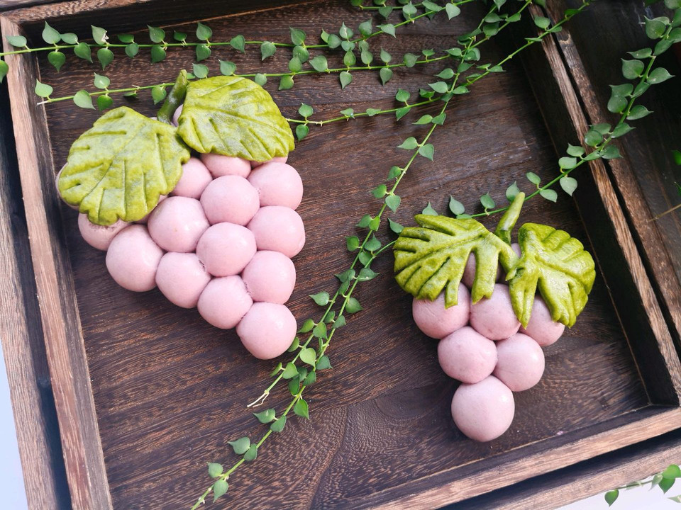

# 星空银耳羹｜超梦幻的养生小甜品

## 📋 基本資訊 / Recipe Overview
- **料理名稱**：星空银耳羹｜超梦幻的养生小甜品
- **原始標題**：#我的养生日常-远离秋燥#星空银耳羹｜超梦幻的养生小甜品
- **素食流派 / Diet**：全素 Vegan
- **料理分類 / Category**：家常蔬食 / 經典熱菜
- **來源平台 / Source**：[豆果美食 · 素食專區](https://www.douguo.com/cookbook/3118854.html)

## 🌿 食材及佐料清單 / Ingredients
- 新鲜银耳 半朵
- 蝶豆花 8朵
- 冰糖 适量
- 柠檬片 2片
- 椰奶 适量(可选)

## 🍳 烹飪步驟 / Step-by-Step Cooking Steps
1. 鲜银耳剪去根部撕碎洗净，加入适量清水炖煮30分钟至软糯出胶，加入冰糖融化后盛出放凉冷藏备用。
2. 蝶豆花加入小半碗开水浸泡出深蓝色茶汤，滤出茶水备用。
3. 将炖好的胶质银耳羹盛入透明玻璃碗或杯中做底。
4. 轻轻沿杯壁缓缓倒入深蓝色蝶豆花水，形成唯美的星空渐变分层。
5. 挤入几滴新鲜柠檬汁，遇酸后蓝色蝶豆花水会瞬间变幻为梦幻的紫粉色星空效果。

## 💡 大廚美味秘訣 / Chef's Tips
- 蝶豆花富含花青素，遇到柠檬汁中的酸性物质会产生天然酸碱变色，呈现绝美的星空渐层。

---
*食譜歸檔時間：2026-08-20 · 來源：豆果美食 (www.douguo.com)*