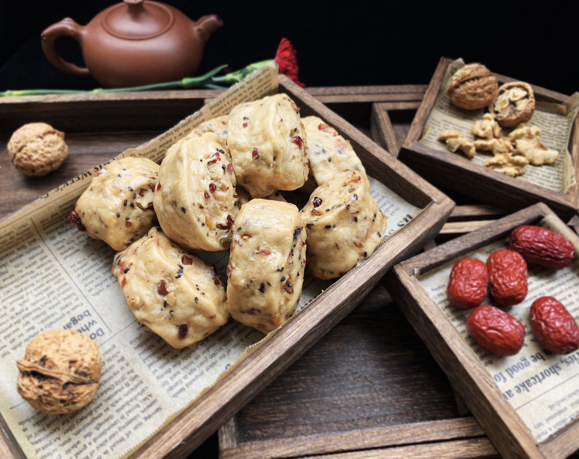

# 核桃红枣馒头

## 📋 基本資訊 / Recipe Overview
- **料理名稱**：核桃红枣馒头
- **原始標題**：核桃红枣馒头
- **素食流派 / Diet**：全素 Vegan
- **料理分類 / Category**：烘焙麵點 / 點心
- **難易度 / Difficulty**：切墩(初级)
- **烹飪時間 / Cooking Time**：1小时以上
- **來源平台 / Source**：[豆果美食 · 素食專區](https://www.douguo.com/cookbook/2301034.html)

## 📝 料理故事與簡介 / Story & Introduction
> 我的朋友圈中，大家都比较喜欢的一款早点。我也会经常做一些放冰箱里，早晨醒来蒸上几个，加一杯牛奶就是元气满满的一天。大人和小孩都特别喜欢。

## 🌿 食材及佐料清單 / Ingredients
- 面粉：500g
- 酵母：5g
- 泡打粉：3g
- 核桃仁：50g
- 红枣：50g
- 红糖：50g
- 蔓越莓干：30g
- 黑芝麻：15g

## 🍳 烹飪步驟 / Step-by-Step Cooking Steps
1. 拿一个干净的容器，放入面粉和泡打粉。
2. 用温水把红糖化开，放入酵母化开
3. 红糖水慢慢地倒入面粉中，一边用筷子搅成絮状
4. 把面粉揉成光滑的面团。盖上锅盖醒两个小时左右。
5. 核桃仁红枣蔓越干切成小块备用
6. 发好的面团中倒入切好的果仁
7. 果仁和面和成一团醒20分
8. 揉成长条
9. 切成小段放入蒸锅蒸15分钟，关火再焖10分钟
10. 虽然外貌有点丑，但是却巨好吃

## 💡 大廚美味秘訣 / Chef's Tips
- 这款馒头我经常做，把果仁和面一起发，没有发好面后再加果仁好。因为果仁放得较多，馒头会比白面馒头更劲紧实一点。红糖多少按个人的口味放。

---
*食譜歸檔時間：2026-08-20 · 來源：豆果美食 (www.douguo.com)*