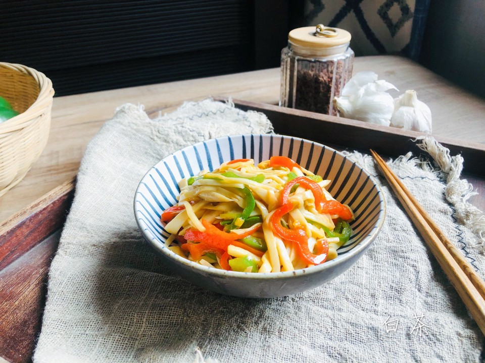

# 比肉还好吃的青椒杏鲍菇

## 📋 基本資訊 / Recipe Overview
- **料理名稱**：比肉还好吃的青椒杏鲍菇
- **原始標題**：比肉还好吃的青椒杏鲍菇
- **素食流派 / Diet**：全素 Vegan
- **料理分類 / Category**：家常蔬食 / 經典熱菜
- **來源平台 / Source**：[豆果美食 · 素食專區](https://www.douguo.com/cookbook/3022993.html)

## 🌿 食材及佐料清單 / Ingredients
- 杏鲍菇 4个
- 青椒 1个
- 红椒 1个
- 生抽 1勺
- 老抽 1勺
- 盐 1克
- 鸡精 1克
- 糖 1克

## 🍳 烹飪步驟 / Step-by-Step Cooking Steps
1. 材料准备好。
2. 杏鲍菇切片。
3. 然后切丝。
4. 青椒和红椒去籽切丝。
5. 锅里放油，可以多放点，杏鲍菇吸油。放入切好的辣椒丝翻炒，加入盐，让青椒入味。
6. 待青椒丝变软，加入杏鲍菇。
7. 待杏鲍菇也变软时，加入生抽，老抽，鸡精和糖翻炒均匀，稍稍焖一下即可出锅。
8. 咸鲜入味，超级下饭！
9. 你也试试吧！

## 💡 大廚美味秘訣 / Chef's Tips
- 这道菜比较吃油，可以多放点。或者不想放油太多的话，杏鲍菇可以焯水两分钟再下锅翻炒。均衡的膳食对宝宝健康成长很关键哦，但要提醒饮食均衡还远远不够，日常饮食也有营养“缺口”，如维生素AD就不易从食物中获取充足。维生素AD能提高宝宝免疫力，促进骨骼发育、身高增长，预防近视和贫血。功夫在日常，每天还要记得补充一粒伊可新维生素AD滴剂哦~

---
*食譜歸檔時間：2026-08-21 · 來源：豆果美食 (www.douguo.com)*