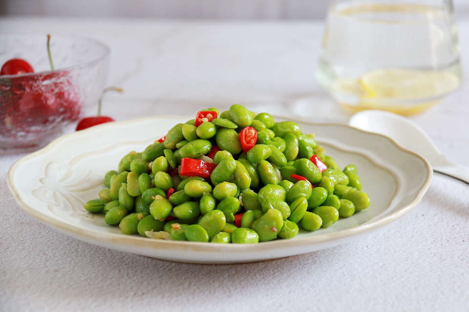

# 清炒毛豆

## 📋 基本資訊 / Recipe Overview
- **料理名稱**：清炒毛豆
- **原始標題**：清炒毛豆
- **素食流派 / Diet**：全素 Vegan
- **料理分類 / Category**：家常蔬食 / 經典熱菜
- **來源平台 / Source**：[豆果美食 · 素食專區](https://www.douguo.com/cookbook/2330574.html)

## 🌿 食材及佐料清單 / Ingredients
- 毛豆 一盘
- 蒜 2瓣
- 小米椒 3个

## 🍳 烹飪步驟 / Step-by-Step Cooking Steps
1. 毛豆、蒜、小米辣 
不吃辣椒可以不放，但是放上辣椒更好吃，最好买现成拨好的毛豆，要不然会拨到手疼。
2. 蒜爆香
3. 放毛豆翻炒
4. 加入少量水，放入辣椒，少量盐，盖盖子焖几分钟，不要时候太长，会黄。
5. 出锅

## 💡 大廚美味秘訣 / Chef's Tips
- 清炒毛豆不仅很大程度保留了毛豆中的营养成分，还比较清淡，低脂又健康。
 微微脆的毛豆裹着微微的辣，非常好吃，一定要试试哦！

---
*食譜歸檔時間：2026-08-21 · 來源：豆果美食 (www.douguo.com)*