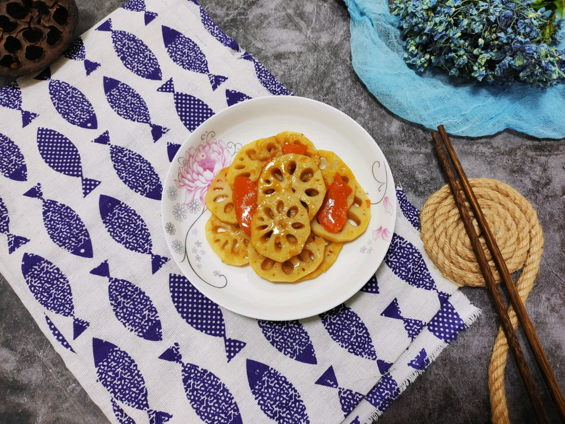

# 清炒脆藕片

## 📋 基本資訊 / Recipe Overview
- **料理名稱**：清炒脆藕片
- **原始標題**：清炒脆藕片
- **素食流派 / Diet**：全素 Vegan
- **料理分類 / Category**：家常蔬食 / 經典熱菜
- **來源平台 / Source**：[豆果美食 · 素食專區](https://www.douguo.com/cookbook/2363354.html)

## 🌿 食材及佐料清單 / Ingredients
- 藕 1节
- 姜片 少许
- 胡萝卜 一节
- 蒜头 一瓣

## 🍳 烹飪步驟 / Step-by-Step Cooking Steps
1. 莲藕切薄片
2. 热锅热油下胡萝卜片爆炒
3. 加入生姜蒜头爆香
4. 加入莲藕爆炒
5. 根据个人口味加调味料
6. 出锅

## 💡 大廚美味秘訣 / Chef's Tips
- 喜欢辣椒可以加辣椒，更香，不需要加鸡精就很香甜。

---
*食譜歸檔時間：2026-08-21 · 來源：豆果美食 (www.douguo.com)*