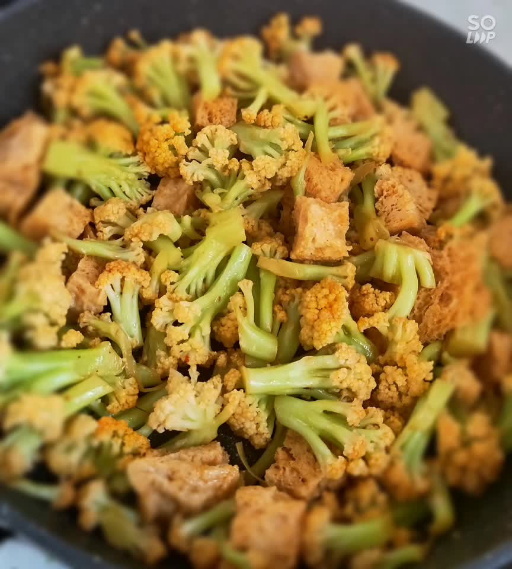

# 清炒菜花

## 📋 基本資訊 / Recipe Overview
- **料理名稱**：清炒菜花
- **原始標題**：清炒菜花
- **素食流派 / Diet**：全素 Vegan
- **料理分類 / Category**：家常蔬食 / 經典熱菜
- **難易度 / Difficulty**：切墩(初级)
- **烹飪時間 / Cooking Time**：10分钟左右
- **來源平台 / Source**：[豆果美食 · 素食專區](https://www.douguo.com/cookbook/2529912.html)

## 📝 料理故事與簡介 / Story & Introduction
> 菜花是最普通家常小菜，而是一般的做法就是素炒或者加肉爆炒等。家人喜欢吃菜花也是有一定的原因所在的，菜花本身所含的营养比较丰富，而且菜花有着良好的解暑的功效。 菜花，又名花椰菜，是一种低热卡、膳食纤维丰富的蔬菜。菜花富含各种维生素，维生素 B族、维生素C族的含量尤其丰富。

## 🌿 食材及佐料清單 / Ingredients
- 菜花：1个
- 葱头：半个
- 面筋：150克
- 小葱：3根
- 植物油：15克
- 盐：3克
- 十三香：3克
- 小米椒：1个
- 花椒：适量
- 鲁花味极鲜：6克
- 青椒：1个
- 蒜：3瓣

## 🍳 烹飪步驟 / Step-by-Step Cooking Steps
1. 菜花洗净拿开水焯好控干水份备用
2. 所有材料洗净切好备用
3. 热锅放油放花椒，小米椒炸糊捞出
4. 放十三香，葱花，蒜片，爆香
5. 放入葱头，青椒丝翻炒均匀
6. 炒至一分钟左右
7. 放入菜花翻炒均匀，撒入盐，鲁花味极鲜，继续翻炒均匀
8. 放入面筋翻炒均匀就可以出锅了
9. 成品图片
10. 成品图片
11. 成品图片

## 💡 大廚美味秘訣 / Chef's Tips
- 1.菜花焯过水的炒的太久会破坏营养成分，
2.所有调料根据自己的喜号加减

---
*食譜歸檔時間：2026-08-20 · 來源：豆果美食 (www.douguo.com)*