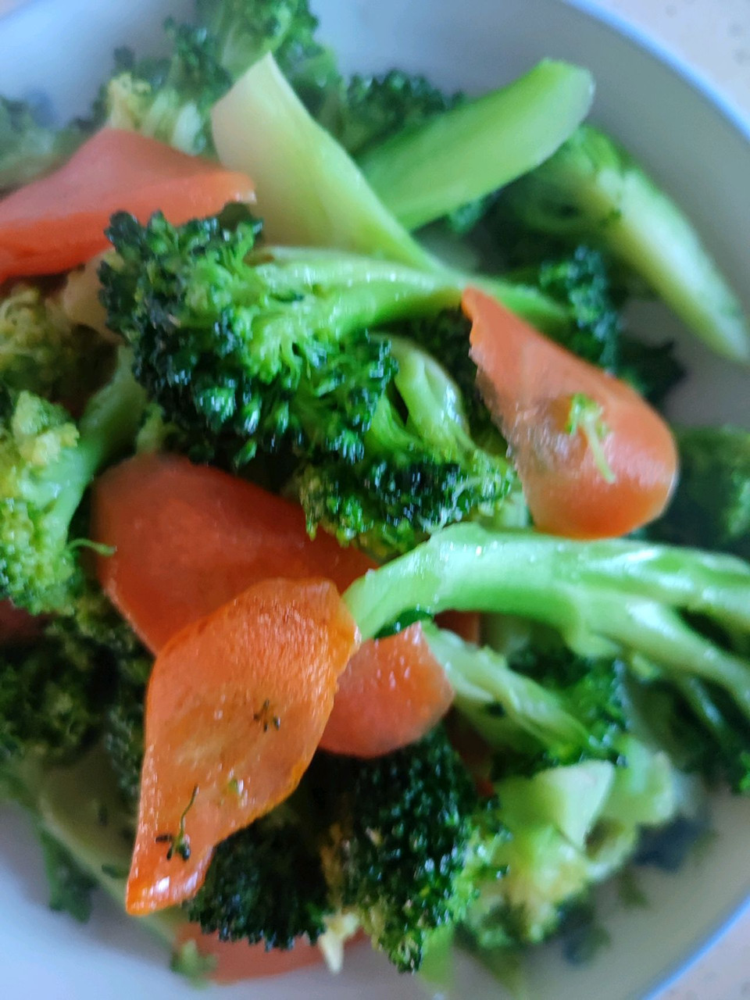

# 清炒西兰花

## 📋 基本資訊 / Recipe Overview
- **料理名稱**：清炒西兰花
- **原始標題**：清炒西兰花
- **素食流派 / Diet**：全素 Vegan
- **料理分類 / Category**：家常蔬食 / 經典熱菜
- **來源平台 / Source**：[豆果美食 · 素食專區](https://www.douguo.com/cookbook/3158052.html)

## 🌿 食材及佐料清單 / Ingredients
- 西兰花 半斤
- 胡萝卜 50g
- 盐 适量
- 食用油 10克

## 🍳 烹飪步驟 / Step-by-Step Cooking Steps
1. 西兰花切掉根，切成小块洗净备用。
2. 胡萝卜去皮切成片
3. 锅中烧水，水开加少许盐，倒入西兰花和胡萝卜焯水一分钟
4. 锅中放油倒入西兰花和胡萝卜翻炒二分钟，加入盐炒匀即可出锅。
5. 原味的最好吃(｢･ω･)｢嘿有营养哦(´-ω-`)

---
*食譜歸檔時間：2026-08-21 · 來源：豆果美食 (www.douguo.com)*