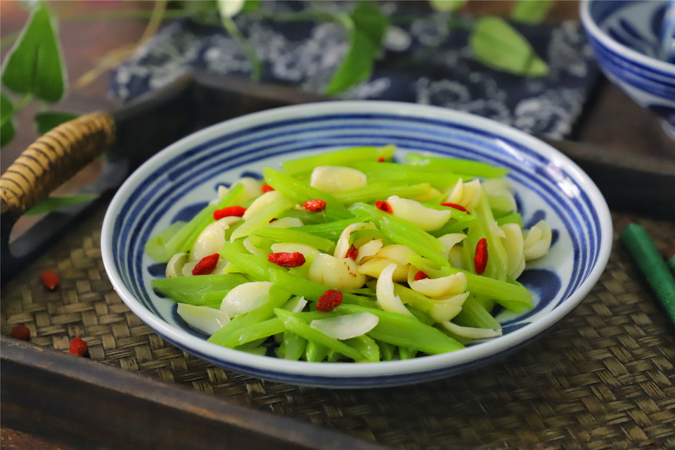

# 清脆爽口，解暑安神的西芹百合

## 📋 基本資訊 / Recipe Overview
- **料理名稱**：清脆爽口，解暑安神的西芹百合
- **原始標題**：清脆爽口，解暑安神的西芹百合
- **素食流派 / Diet**：全素 Vegan
- **料理分類 / Category**：家常蔬食 / 經典熱菜
- **難易度 / Difficulty**：切墩(初级)
- **烹飪時間 / Cooking Time**：10-30分钟
- **來源平台 / Source**：[豆果美食 · 素食專區](https://www.douguo.com/cookbook/2532222.html)

## 📝 料理故事與簡介 / Story & Introduction
> 把西芹和百合两样食材放一起炒，可以说是夏天最佳的搭配，两者的优势互补，既可解暑安神，清火润肺，还有养颜的作用，而且做法也是相当简单，清淡少油，多吃也不怕长肉。

## 🌿 食材及佐料清單 / Ingredients
- 西芹：1把
- 百合：1个
- 盐：适量
- 高汤：1勺
- 油：适量
- 枸杞：1小把

## 🍳 烹飪步驟 / Step-by-Step Cooking Steps
1. 准备好材料，西芹1把，百合1个，如果没有新鲜的百合，用百合干也可以。
2. 百合掰去外面的老叶瓣，用清水洗净后把叶瓣全部掰开，去掉叶瓣内侧的薄衣，西芹撕去外面的老茎，清洗干净。
3. 把清洗干净的西芹用刀斜切成小段。
4. 取一锅倒放适量水，煮开加入少许盐后再滴入几滴油，把西芹和百合一起放入锅中，焯下水后捞出放入事先准备好 的凉开水中。
5. 锅中倒入适量油，油热后把西芹和百合一起倒入锅中。
6. 翻炒均匀后加入1勺高汤，少许盐调下味。
7. 再淋入少许水淀粉，翻炒均匀后即可熄火，出锅前撒入1小把枸杞就可以了。
8. 清淡少油，低脂营养的西芹百合。
9. 多吃也不用担心涨胖。
10. 成品

## 💡 大廚美味秘訣 / Chef's Tips
- 1、西芹和百合提前焯水，可以减少西芹和百合的烹饪时间，这样吃起来的口感更好。2、焯过水的西芹和百合，要用冷开水过下凉下，这样不仅颜色看起来更好看。

---
*食譜歸檔時間：2026-08-20 · 來源：豆果美食 (www.douguo.com)*