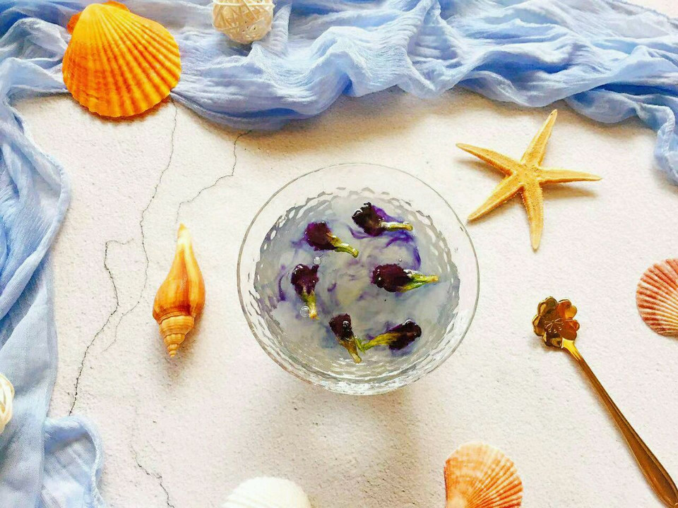

# 渐变银耳羹

## 📋 基本資訊 / Recipe Overview
- **料理名稱**：渐变银耳羹
- **原始標題**：渐变银耳羹
- **素食流派 / Diet**：全素 Vegan
- **料理分類 / Category**：湯品羹湯
- **難易度 / Difficulty**：切墩(初级)
- **烹飪時間 / Cooking Time**：10~30分钟
- **來源平台 / Source**：[豆果美食 · 素食專區](https://www.douguo.com/cookbook/2328021.html)

## 📝 料理故事與簡介 / Story & Introduction
> 异常闷热的午后，想念那静谧深邃的大海，想念海水那抹蓝，给人清凉冰爽的感觉，如果置身于海水之中，想必这闷热就不复存在了吧 [奸笑]
那就给自己整片大海吧
一份银耳羹，再来几朵蝶豆花，这大海就呈现在你眼前啦[偷笑]可惜拍摄技术有限，拍不出它万分之一的美……
用一个自己喜欢的玻璃容器，盛一份温热的银耳羹，放几朵冲洗千净的蝶豆花，放置一会，蝶豆花的颜色会慢慢析岀，用筷子挑一挑蝶豆花，就会带出渐变的蓝色……宛如置身于海边，眼前有深邃的大海，海水拍打着海岸随潮水而来的还有贝壳，海星……
还有带着咸味的海风，给这个闷热的午后带来了一份凉爽……

## 🌿 食材及佐料清單 / Ingredients
- 鲜银耳：半朵
- 鲜莲子：110克
- 蝶豆花：数朵
- 冰糖：适量

## 🍳 烹飪步驟 / Step-by-Step Cooking Steps
1. 银耳切掉根部，洗净撕成小朵备用
2. 莲子去掉莲子芯，洗净备用
3. 蝶豆花洗净沥干水分备用
4. 把莲子和银耳一起放入锅中加入适量的水，大火煮开转中小火煮至银耳出胶，莲子绵糯
5. 根据个人口味加入适量冰糖调味，即可出锅
6. 找一个自己喜欢的玻璃容器把银耳羹盛入，把蝶豆花放进去浸泡一会至蝶豆花的颜色析出，用筷子挑一挑蝶豆花就会带出渐变的色彩
7. 一杯有层次感的银耳羹就搞定啦
8. 很漂亮的哦

## 💡 大廚美味秘訣 / Chef's Tips
- 1、银耳羹一定要温热的，这样蝶豆花才能泡出颜色哦！
2、冰糖的量，根据自己的口味来调整哦！

---
*食譜歸檔時間：2026-08-20 · 來源：豆果美食 (www.douguo.com)*