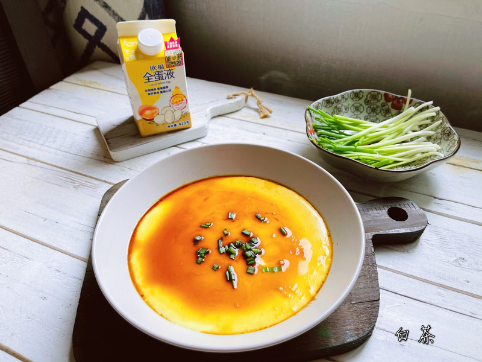

# 滑滑嫩嫩的水蒸蛋，简单几步就能做

## 📋 基本資訊 / Recipe Overview
- **料理名稱**：滑滑嫩嫩的水蒸蛋，简单几步就能做
- **原始標題**：#蛋趣体验#滑滑嫩嫩的水蒸蛋，简单几步就能做
- **素食流派 / Diet**：蛋素 Ovo-Vegetarian
- **料理分類 / Category**：家常蔬食 / 經典熱菜
- **來源平台 / Source**：[豆果美食 · 素食專區](https://www.douguo.com/cookbook/3107173.html)

## 🌿 食材及佐料清單 / Ingredients
- 全蛋液 110克
- 温水 250克
- 盐 1克
- 小葱 1颗
- 生抽 1勺

## 🍳 烹飪步驟 / Step-by-Step Cooking Steps
1. 欧福全蛋液110克，如果没有全蛋液就用两个鸡蛋。鸡蛋一般重量在50克-55克，也就是两个鸡蛋的重量，有3-5克误差没事。
2. 倒入温水搅拌均匀。
3. 搅拌均匀后加入盐，这样可以帮助鸡蛋定型。
4. 用勺子把泡沫撇掉，防止蒸出来的鸡蛋坑坑洼洼。
5. 盖上保鲜膜扎几个洞，或者倒扣一个盘子也可以。
6. 水开后放入鸡蛋液，大火蒸12分钟。蒸熟后不要立刻掀开锅盖，焖3-5分钟再打开锅盖。
7. 这个时候你就得到一个完美的水蒸蛋。
8. 撒上葱花。
9. 倒上一勺生抽就可以啦，真的非常简单。

## 💡 大廚美味秘訣 / Chef's Tips
- 水蒸蛋：鸡蛋液加入的温水控制在30度以内。

---
*食譜歸檔時間：2026-08-20 · 來源：豆果美食 (www.douguo.com)*