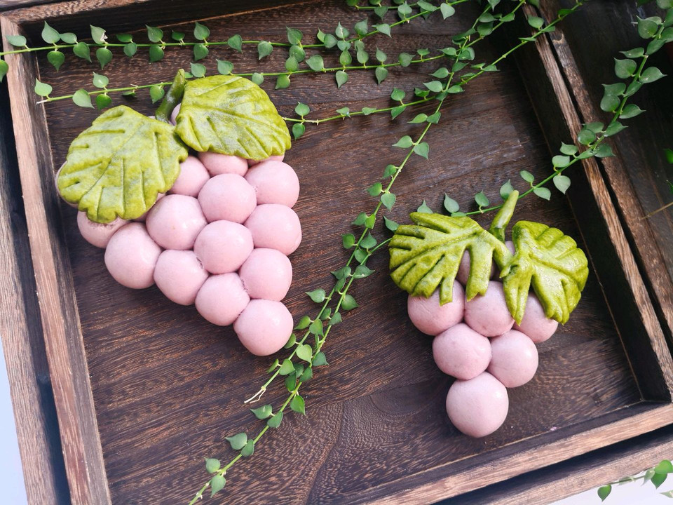

# 烧茄子

## 📋 基本資訊 / Recipe Overview
- **料理名稱**：烧茄子
- **原始標題**：#餐桌上的春日限定#烧茄子
- **素食流派 / Diet**：全素 Vegan
- **料理分類 / Category**：家常蔬食 / 經典熱菜
- **來源平台 / Source**：[豆果美食 · 素食專區](https://www.douguo.com/cookbook/2441539.html)

## 🌿 食材及佐料清單 / Ingredients
- 圆茄子 1个
- 青红椒 各半个
- 生抽 2勺
- 老抽 半勺
- 香醋 1勺
- 白糖 1勺
- 盐 半茶匙
- 玉米淀粉 适量
- 植物油 适量

## 🍳 烹飪步驟 / Step-by-Step Cooking Steps
1. 茄子去皮切滚刀块，撒少许盐抓匀腌制10分钟挤出黑水，裹上一层薄薄的干淀粉（锁水防吸油）。
2. 青红椒洗净切块；碗中调入生抽、老抽、香醋、糖、盐、水淀粉和清水调成碗汁。
3. 热锅倒适量油，放入裹好淀粉的茄子中小火煎炒至外皮金黄酥脆变软捞出。
4. 锅留底油下青红椒块煸炒断生，倒入煎好的茄子块。
5. 淋入调好的碗汁大火快速翻炒裹匀酱汁，待芡汁浓稠透亮即可关火出锅。

## 💡 大廚美味秘訣 / Chef's Tips
- 茄子先腌出水分再裹淀粉煎，相比油炸大幅减少吸油量，外酥里嫩鲜香下饭。

---
*食譜歸檔時間：2026-08-20 · 來源：豆果美食 (www.douguo.com)*