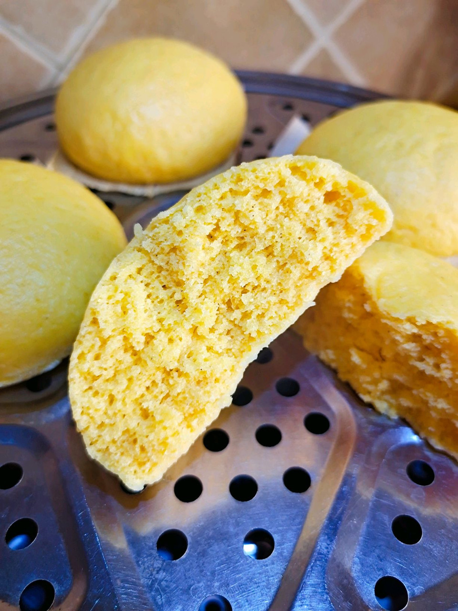

# 玉米面馒头 (2)

## 📋 基本資訊 / Recipe Overview
- **料理名稱**：玉米面馒头 (2)
- **原始標題**：玉米面馒头
- **素食流派 / Diet**：全素 Vegan
- **料理分類 / Category**：米食料理
- **難易度 / Difficulty**：切墩(初级)
- **烹飪時間 / Cooking Time**：30~60分钟
- **來源平台 / Source**：[豆果美食 · 素食專區](https://www.douguo.com/cookbook/2417559.html)

## 🌿 食材及佐料清單 / Ingredients
- 普通面粉：250克
- 玉米面：250克
- 酵母粉：5克
- 温水：适量

## 🍳 烹飪步驟 / Step-by-Step Cooking Steps
1. 准备玉米面和面粉
2. 和匀
3. 酵母温水化开
4. 酵母水倒入面粉，揉成光滑的面团，盖上保鲜膜，温暖处发酵至两倍大
5. 发酵好的面团，揉搓排气
6. 分成剂子，揉好，放蒸锅发酵半个小时，大火蒸20分钟，蒸好闷5分钟，在揭锅盖
7. 蒸好的玉米面馒头
8. 粗粮吃起来！

---
*食譜歸檔時間：2026-08-20 · 來源：豆果美食 (www.douguo.com)*