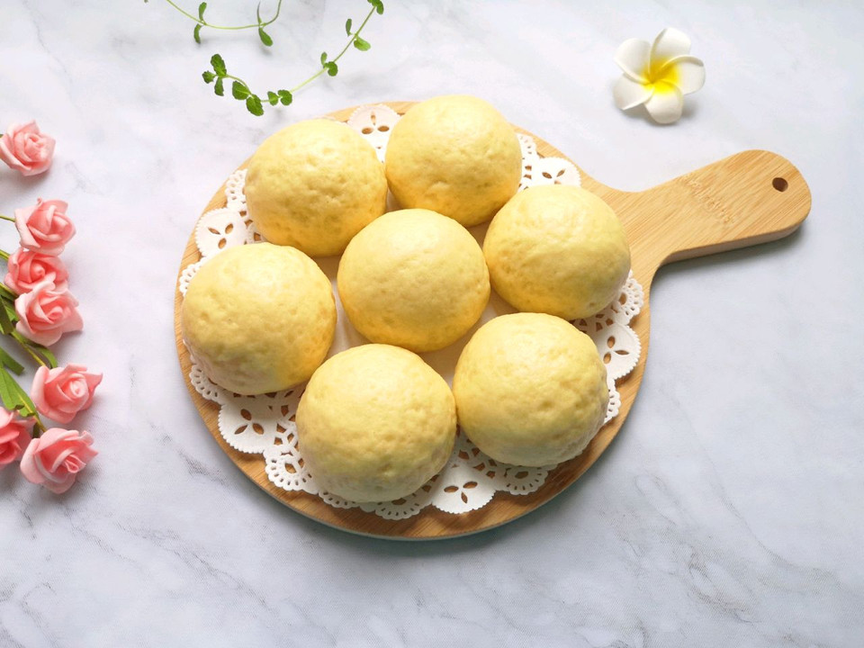

# 玉米馒头

## 📋 基本資訊 / Recipe Overview
- **料理名稱**：玉米馒头
- **原始標題**：玉米馒头
- **素食流派 / Diet**：全素 Vegan
- **料理分類 / Category**：米食料理
- **來源平台 / Source**：[豆果美食 · 素食專區](https://www.douguo.com/cookbook/3096572.html)

## 🌿 食材及佐料清單 / Ingredients
- 玉米面粉 400g
- 中筋面粉 100g
- 温水 285g
- 糖 15g
- 发酵粉 5g

## 🍳 烹飪步驟 / Step-by-Step Cooking Steps
1. 准备好玉米粉和中筋面粉，混合均匀。
2. 温水中加入糖和发酵粉混合均匀。
3. 倒入混合好的面粉。
4. 用筷子搅拌成絮状。
5. 揉成面团。
6. 盖上保鲜膜发酵至两倍大。
7. 看一下发酵好的面团，内部呈细密的蜂窝状。
8. 发酵好的面团揉光排气。
9. 搓成长条分成小剂子。
10. 取一个小剂子揉光滚圆，做好馒头生胚。
11. 锅里放水放篦子，馒头生胚垫上油纸，移至篦子上，盖上锅盖二次发酵10分钟左右。
12. 凉水开火，上汽后转中火蒸20分钟关火，焖5分钟左右出锅。
13. 还做了一些玉米荷叶饼。
14. 玉米馒头闻起来特别香。
15. 口感也不错。
16. 够吃好几天了。

---
*食譜歸檔時間：2026-08-21 · 來源：豆果美食 (www.douguo.com)*